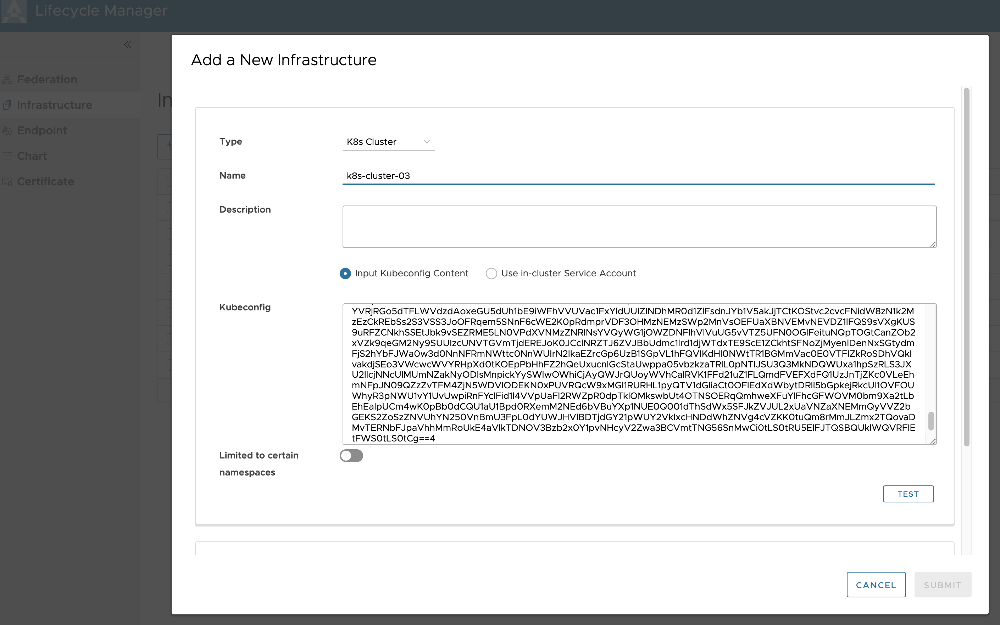

# Getting Started Guide for FATE Federations Management

## Overall Architecture and Steps

This document provides an end-to-end guide to creating a FATE federation using FedLCM, i.e., the Federation Lifecycle Manager service. Currently, FATE instances deployed here use Spark and Pulsar as the backend and connect with each other via an exchange.
The overall deployment architecture is below diagram:

<div style="text-align:center">

</div>

The high-level steps are:

1. FedLCM connects to Kubernetes clusters via corresponding kubeconfig.
2. It then installs KubeFATE services onto K8s clusters as endpoints.
3. Federation entities can be created as a logical container for future FATE deployment.
4. For one federation, FedLCM firstly deploys a FATE exchange into a K8s cluster with the help of KubeFATE.
5. Then, it creates several FATE clusters as different parties into different K8s clusters, also by working with KubeFATE services.
6. Jupyter Notebook is created for each FATE cluster, and users can start using it to start FML jobs.
7. Alternatively, for each FATE v1.6.1 deployment, FedLCM provides a management portal called "Site Portal" that can also be used to manage FATE jobs.

## Prerequisites

FedLCM works with Kubernetes clusters to deploy KubeFATE and FATE. It can accelerate the overall workflow and enable more features if your cluster has applications like Ingress Controllers, StorageClass Provisioners and LoadBalancer Providers installed. But it isn't a hard requirement for minimal FATE federation deployments.

> Currently, FedLCM needs cluster-admin privilege to manage the FATE deployments.

## Deployment

The FedLCM service can be deployed via docker-compose or in a K8s cluster. Refer to the [README](../README.md) doc for the steps.

After deploying the FedLCM service, access the web UI from a browser:
<div style="text-align:center">

</div>

The login credential can be configured via modifying the docker-compose yaml or the k8s_deploy yaml. The default is `Admin:admin`.

## Configuring CA

The FedLCM service depends on a CA service to issue certificates for the deployed components. To configure one, go to the Certificate section and click the `NEW` button. Currently, this service can work with a StepCA server. And both the docker-compose deployment and the K8s deployment contain a built-in StepCA server that can be used directly.

<div style="text-align:center">

</div>

Click `SUBMIT` to save the CA configuration.

## Adding Infrastructure

Kubernetes clusters are considered as Infrastructures in the FedLCM service. All the other installation activities are performed on these K8s clusters. To deploy other services, including KubeFATE and FATE clusters, you must add the target K8s cluster as infrastructure.

Go to the `Infrastructure` section and click the `NEW` button. Provide some basic information of this infrastructure, especially the kubeconfig content, which FedLCM will use to connect to the K8s cluster.

> **The user configured in the kubeconfig section should have the privilege to create all core K8s resources, including namespace, deployment, configmap, role, secret, etc.**

<div style="text-align:center">

</div>

Click `TEST` to make sure the cluster is available. Then click `SUBMIT` to save the new infrastructure.

> You can toggle the switch of *Configure Registry* to user your own image registry. It will be used as the default registry for future FATE deployment on this K8s cluster. If not configured, images will by default be fetched from Docker Hub.
> 
> You can also optionally enable *Use Registry Secret* to provide your registry credentials.

In practical use, there will be several K8s clusters from different organizations. In this guide, we added two clusters to demonstrate a minimal workflow.

## Adding or Installing KubeFATE

In the `Endpoint` section, you can install KubeFATE service into a K8s infrastructure. And later it can be used to deploy FATE components.

To add a new KubeFATE endpoint, select an existing infrastructure and FedLCM will try to find if there is already a KubeFATE service running. If so, it will add the KubeFATE service into its database directly. If not, an installation step will be provided as shown below:

<div style="text-align:center">

</div>

Click `GET KUBEFATE INSTALLATION YAML` to get the deployment yaml file. You can make changes to the yaml content to further customize your KubeFATE installation, but the default one is typically sufficient.

We depend on *Ingress* and *Ingress Controllers* to work with the KubeFATE service. You can optionally click the `Install an Ingress Controller for me` checkbox to install an ingress-nginx controller with some predefined configurations.

**Only select the LoadBalancer service type if you know your cluster can support that.**

<div style="text-align:center">

</div>

Click `SUBMIT` and wait for the endpoint status to become ready. Check the event tab of the endpoint to see its detailed deployment events. And perform the same steps to install KubeFATE in other infrastructures.

>An KubeFATE endpoint can only work with the K8s cluster it runs on. All the target K8s clusters should have their own KubeFATE service installed.

## Creating Federations

Now, on the `Federation` page, we can create new federations. Just click `NEW` and provide some basic information.

<div style="text-align:center">

</div>

The domain field will be used to generate the hostnames for the FATE and exchange components created in this federation. For example, the Pulsar service will use a certificate that indicates its name to be `<party_id>.<domain>`. And ingress addresses are also generated based on this domain field. In this guide we input `example.com` as the base domain name.

## Creating Participants

### Creating Exchange

In a just created federation, we firstly need an exchange. Click the `NEW` button under *Exchange* section in *FATE Federation Detail* page. And follow the steps to create a new exchange.

<div style="text-align:center">

</div>

> Note:
> * To use the FedLCM's Site Portal service, choose the “chart for FATE exchange v1.6.1 with fml-manager service” when selecting the chart. Otherwise, this federation cannot use Site Portal even if the FATE cluster contains one.
> * It is suggested to choose `Install certificates for me` in *the Certificate* section. Only select `I will manually install certificates` if you want to import your own certificate instead of using the configured CA to create a new one.
> * Choose `NodePort` if your cluster doesn't have any controller that can handle `LoadBalancer` type of service.
> * If your cluster doesn't enable [Pod Security Policies](https://kubernetes.io/docs/concepts/security/pod-security-policy/), you don't have to enable it in *Pod Security Policy Configuration* section.

Finally, get the yaml content, verify it is correct and click `SUBMIT`. 

Now, the FedLCM system will start installing the exchange, which is listed in the corresponding section:

<div style="text-align:center">

</div>

### Creating Clusters

After the exchange's status becomes `Active`, FATE clusters could be added to the federation. Click the `NEW` button under the *Cluster* section and follow the steps to add a new FATE cluster.

<div style="text-align:center">

</div>

> Most of the steps are the same as configuring an exchange; see more in the note above.
> Choose the "chart for FATE cluster v1.6.1 with site-portal" chart to deploy FATE clusters with site-portal support.

Finally, get the yaml content, verify it is correct and click `SUBMIT`.

Creating a cluster may take more time than creating an exchange. You can go to *Cluster Detail* page by clicking a certain cluster name to access more information and some useful logs are provided in the *event* tab.

## Run FATE Jobs

Here we have created two FATE clusters called `cluster-01` and `cluster-02` correspondingly with party id `9999` and `10000`.

<div style="text-align:center">

</div>

By clicking a certain cluster name, cluster detail will show in a new page:

<div style="text-align:center">

</div>

If the FATE cluster contains a Site Portal service, it will be shown in the *Exposed Service* section, and we can click into it to work with our FML management portal. Refer to the [portal's guide](./Site_Portal_In_FedLCM_Configuration_Guide.md) on the usage.

We can see some other core services in *Ingress Info* section and the most important two are `client` and `fateboard`. Client service is used for creating a FATE job and fateboard service is used for monitoring jobs on FATE clusters.

We will use the address in the Hosts field to access these services from a web browser. In order to do that, these addresses should be resolved to the ingress controller's expose service IP address. This can be done by either changing your machine's *hosts* file or configuring your DNS server. In most of the cases, the target IP is the IP address in the Addresses column.

**But if your ingress controller's service is exposed as `NodePort`, then you should use your node's IP, which might not be the address shown in the table.** Below example shows how to work with an ingress controller that is exposed as `NodePort`.

```
# Connect to your k8s cluster and get the information of ingress controller service by executing:
kubectl get svc -n ingress-nginx ingress-nginx-controller


# We can see the port exposed in the message:
NAME                       TYPE       CLUSTER-IP       EXTERNAL-IP   PORT(S)                      AGE
ingress-nginx-controller   NodePort   10.103.193.113   <none>        80:30637/TCP,443:32069/TCP   119m

# Then on the node we want to accept the connnection, manually redirect the connection on port 80 of this node to this service by executing (Replace `<PORT>` with the actual exposed port number(30637 in this case).):
nohup socat TCP-LISTEN:80,fork TCP:localhost:<PORT> > /dev/null 2>&1 &
```

Now, we can access FATE notebook page with the host address of client service in *Ingress Info* section and [run FATE job, like examples from KubeFATE project](https://github.com/FederatedAI/KubeFATE/blob/master/docs/tutorials/Build_Two_Parties_FATE_Cluster_in_One_Linux_Machine_with_MiniKube.md#run-a-fate-example) through your web browser:

<div style="text-align:center">

</div>

And access fateboard page to see the current status of the running jobs via the host address of fateboard service.

<div style="text-align:center">

</div>

If everything goes well, the progress of the job should reach 100%, which means the federation can work as expected. And you can see more details in the job summary as below: 

<div style="text-align:center">

</div>

> Alternatively, if we deployed FATE v1.8.0, then we can use `flow test toy` command to run a toy example test to verify everything works fine.

## Destroying the Federation

To delete a federation, we need to remove all clusters in the federation first, then remove the exchange, and finally just click `delete` in `Federation` section to destroy the federation.

And to delete an infrastructure, all endpoints in the k8s cluster need to be removed (which requires all FATE deployments be uninstalled firstly).

## Next Steps

1. The example shown above is the simplest use of FedLCM. You can explore more functions and feedback are welcome.
2. Default yaml files were used in the example, you can customize them according to your needs.
3. When deploying FATE v1.6.1 with Site Portal service, we can create FATE jobs via this web service. For more detailed introduction of that service, follow the document [here](./Site_Portal_In_FedLCM_Configuration_Guide.md).
