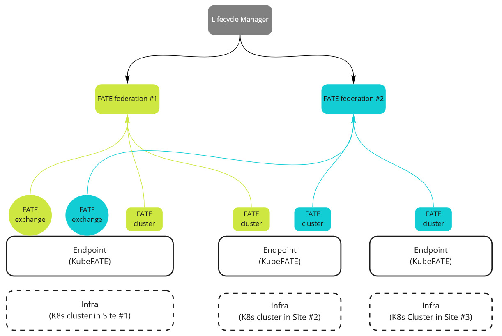
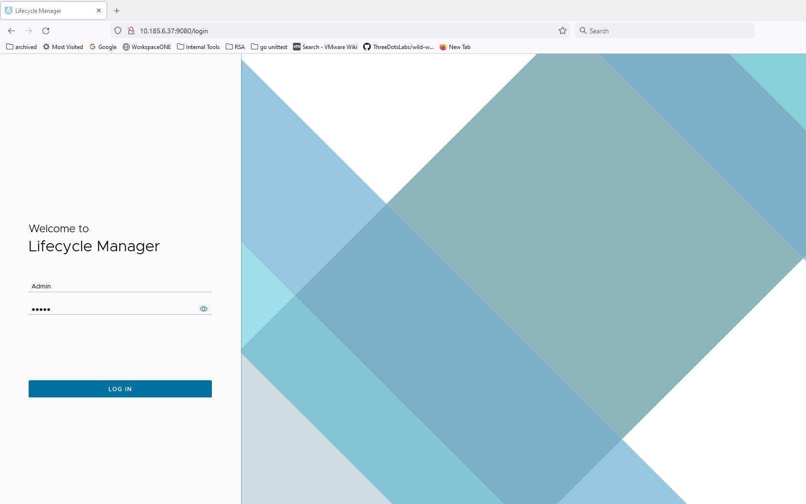
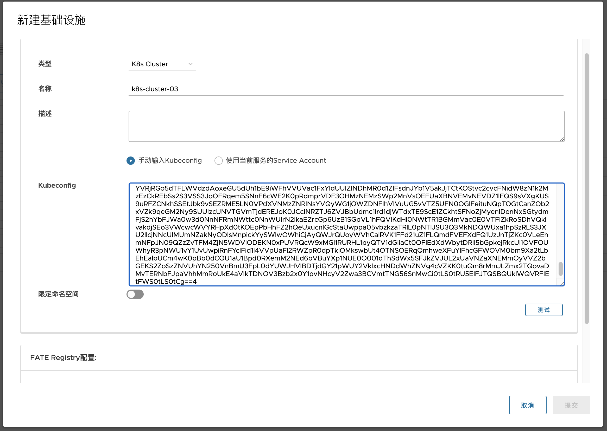
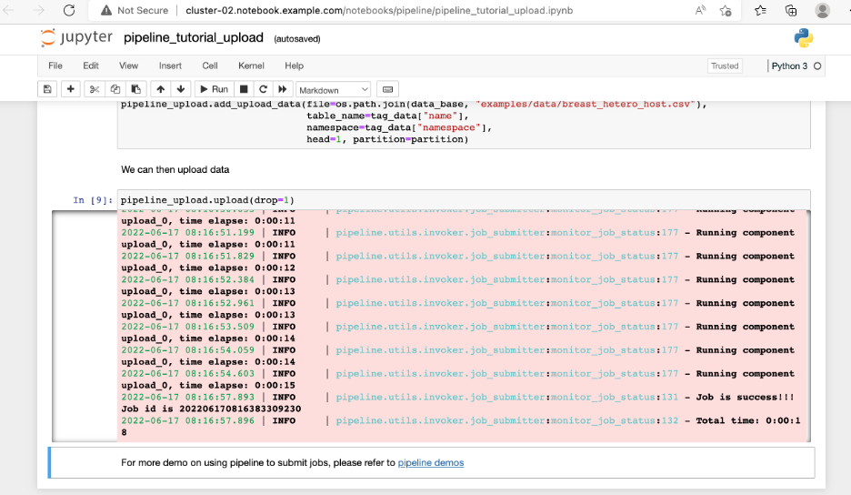
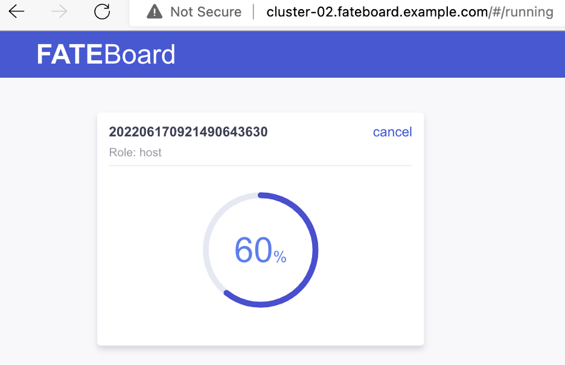

# FATE 联邦管理指南

## 总体架构及流程概览

本文档主要介绍如何使用 FedLCM（即 Federation Lifecycle Manager）创建 FATE 联邦并部署FATE实例。目前FedLCM系统支持部署的FATE实例都是以Spark和Pulsar作为基础引擎，并使用Exchange实现互相连接的。 总体部署架构如下：

<div style="text-align:center">

</div>

部署流程可以概括为如下几步：

1. FedLCM 依据 kubeconfig 文件中的相关信息连接到 Kubernetes 集群。
2. FedLCM 在各个 K8s 集群上安装 KubeFATE 作为服务端点。
3. 之后用户可以通过FedLCM创建一个甚至多个“联邦”。
4. 对于某个特定的联邦，FedLCM 通过 KubeFATE 首先在指定的 K8s 集群上部署一个 FATE exchange 服务。
5. 然后 FedLCM 可以在不同的 K8s 集群上创建多个 FATE cluster 作为不同的参与方。
6. 每个 FATE cluster 都会创建对应的 Jupyter Notebook，其可以用来创建 FML jobs。
7. 特别的，对于每个部署的是 FATE v1.9.1 的 cluster，FedLCM 还提供了名为“Site Portal”的服务来方便用户管理FATE的数据、任务、项目等。

## 前置要求

FedLCM 部署 KubeFATE 和 FATE 都是在 Kubernetes 集群中进行。如果您的K8s集群中已经安装有 Ingress Controllers、StorageClass Provisioners 和 LoadBalancer Providers 等服务，那么 FedLCM 能够利用这些服务来提供更丰富的功能和加速FATE的部署。但对于最简 FATE 联邦的部署，这些额外的服务并不是必须的。

> 目前 FedLCM 支持使用 [cluster-admin 或者某一个或几个 namespace-admin 的权限和角色](https://kubernetes.io/zh-cn/docs/reference/access-authn-authz/rbac/#user-facing-roles) 来部署以及管理 FATE和 KubeFATE。两种权限的不同在后文会给予说明。

## 部署 FedLCM

FedLCM 服务本身的部署支持 docker-compose 运行的方式或者在 K8s 集群中部署。详细步骤参见 [README](../README.md) 文档。特别的，对于K8s的部署，我们可以修改`rbac_config.yaml`文件来为FedLCM服务的Service Account赋予更多权限，使其可以更为方便地直接在自身所在的K8s集群上部署FATE和KubeFATE。

成功部署 FedLCM 服务后, 用户可通过浏览器访问其 Web 界面:

<div style="text-align:center">

</div>

登录口令可以在 docker-compose 的 yaml 文件或者 k8s_deploy yaml 文件中进行配置。默认口令为 `Admin:admin`。交互界面默认语言为英文，登录成功后可以通过右上角的菜单切换语言。

## 配置 CA

FedLCM 服务需要通过一个 CA 服务来向各组件签发证书。因此我们需要配置它与一个 CA 服务的连接：在证书页面点击“新建”按钮添加新的证书颁发机构。目前使用 docker-compose 部署 或者 K8s 部署出来的 FedLCM 都会默认内置一个可以直接使用的 StepCA 服务，本文档直接使用这个内置的 CA。

<div style="text-align:center">

</div>

点击 `提交` 保存配置。

## 添加基础设施

在 FedLCM 服务中，Kubernetes 集群被称作基础设施，所有安装活动都是在这些集群上进行。要部署 KubeFATE 和 FATE，必须将目标 K8s 集群添加为基础设施。

切换到“基础设施”页面点击`新建`按钮，填写该基础设施的一些信息，特别是 kubeconfig 文件的内容。或者，如果我们想把当前FedLCM运行的K8s作为基础设置添加的话，可以选择"使用当前服务的Service Account"。

FedLCM默认认为提供的kubeconfig或Service Account有着cluster-admin的权限，如果我们的实际权限只有某些namespace的admin权限，那么需要打开"限定命名空间"的开关，并以逗号为间隔填入对应的namespace。

<div style="text-align:center">

</div>

点击`测试`来确认 FedLCM 可以正常连接到该集群。确认无误后点击 `提交` 保存。

> 可以打开“配置Registry”开关来自定义镜像仓库。之后的部署过程中FATE容器镜像将从这里配置的Registry中拉取。若保留默认配置，则从 DockerHub 拉取。
> 
> 同样可以打开“使用Registry Secret”来配置 registry 的访问凭证。

实际应用中会有来自不同组织的多个 K8s 集群，本文档仅添加两个集群来展示最简使用流程。

## 安装 KubeFATE

在 `服务端点` 页面，点击 `新建` 以在 K8s 集群上安装 KubeFATE 服务。

首先选则列表中的一个基础设施（如果基础设施只包含一个或几个namespace权限，则需同时选择目标namespace），FedLCM 会检测该集群上是否已经安装 KubeFATE。若检测到 KubeFATE 已成功安装并在运行，则直接将其添加至数据库中，否则会执行如下安装步骤：

<div style="text-align:center">

</div>

按照提示配置相关内容，最终生成部署所用 YAML 文件。如需个性化修改默认生成的 YAML 文件，直接在文本框中编辑即可。一般来说默认的 YAML 内容就足够了。

KubeFATE 服务的运行以及交互依赖 Ingress 和 Ingress Controllers，如有需要，您可以选择让 FedLCM 在集群中安装一个基本的 [Ingress-NGINX Controller](https://kubernetes.github.io/ingress-nginx/) 。

> 同一个基础设施上，不同namespace的服务端点应当使用不同的主机名称。

点击 `提交` 并等待服务端点的状态变为“准备就绪”。我们可以在服务端点详情页面的“事件”栏中查看日志信息。用户可以继续在其他 K8s 集群上安装 KubeFATE 。

> KubeFATE 服务只能操作其本身所在的 K8s 集群，因此所有集群都应独立安装自己的 KubeFATE 服务作为服务端点。

## 创建联邦

在联邦页面点击 `新建` 按钮创建新的联邦：

<div style="text-align:center">

</div>

“域”一栏所填域名将会作为主域名，用于生成该联邦的 FATE 和 Exchange 各组件的域名。例如，Pulsar 服务会使用`<party_id>.<主域名>` 作为域名，并使用对应的证书，各服务的 Ingress 地址也会基于此域名生成。示例中我们使用 `example.com` 作为各个服务的主域名。

## 创建参与方

> 注意： 目前每个命名空间namespace中，只能安装一个FATE参与方（无论是 Exchange 还是 Cluster）。

### 创建 Exchange

在 FATE 联邦详情页面的 Exchange 一栏点击 `新建` 按钮，按照提示步骤创建 Exchange。

> 注意:
>
> * 若要使用 FedLCM 的 Site Portal 服务，需在 chart 一栏选择“chart for FATE exchange v1.9.1 with fml-manager service”。
> * 如需自定义证书，则在选择证书一栏选择手动安装，否则勾选“为我安装证书”来使用内置证书签发服务。
> * 如果集群不支持负载均衡则需要选择“节点端口”服务类型。
> * 如果集群没有开启[容器安全策略](https://kubernetes.io/docs/concepts/security/pod-security-policy/) ，则无需在相应配置项中启用。
> * 如果使用的Infrastructure和Endpoint仅有特定namespace权限时，我们在创建Exchange时将会固定使用该namespace，无法修改。

最后，生成 YAML 文件并检查其内容，点击 `提交` 并等待其创建完成：

<div style="text-align:center">

</div>

### 创建 Cluster

待 exchange 的状态变为“活动中”即可创建新的 cluster。点击 Cluster 一栏的 `新建` 按钮，根据提示完成配置步骤：

<div style="text-align:center">

</div>

> * 多数配置与上述 Exchange 的配置过程相似，详情参见以上介绍。
> * 如果使用的Infrastructure和Endpoint仅有特定namespace权限时，我们在创建Cluster时将会固定使用该namespace，无法修改。
> * 如需使用 site-portal 服务，则在 Chart 一栏选择"chart for FATE cluster v1.9.1 with site-portal"。

在默认情况下，FedLCM将会同时以容器的形式部署外部基础引擎，包括Spark、HDFS和Pulsar，如果我们的环境中已经有已存在的这些外部引擎，我们也可以让FedLCM直接使用这些引擎服务。关于如何在"选择外部的引擎"那里进行配置，可以参考[这篇文档](./FATE_External_Engine_zh.md)。

最后，生成 YAML 文件并检查，点击 `提交` 保存设置。

创建 cluster 所需时间可能比创建 exchange 更长，可以在 cluster 详情页点击事件标签查看详细日志记录。

## 运行 FATE Job

此处创建了两个名为 `cluster-01` 和 `cluster-02` 的 cluster，分别对应组织 id `9999` 和 `10000`.

<div style="text-align:center">

</div>

点击某一 cluster 的名称进入详情页：

<div style="text-align:center">

</div>

如果 FATE cluster 包含 Site Portal 服务, 在公开服务一栏会有相应链接，点击进入后即可根据[文档](./Site_Portal_In_FedLCM_Configuration_Guide_zh.md)进行相关操作。

在 Ingress 信息一栏可以看到多个其他服务的访问地址信息，其中 client 服务提供创建 FATE job的功能，fateboard 服务提供监控 job 的功能。为了能访问到这两个服务，需要用户修改 hosts 文件或者配置 DNS 服务器，将“主机”列的域名解析到Ingress Controller服务暴露的IP地址。一般来说，这个IP地址就是“地址”列里的IP。

**但是如果 Ingress Controller 服务类型是“NodePort”，则需要使用相应节点的 IP 地址，而非“地址”列所示 IP。** 以下示例展示了这种使用“NodePort”类型的服务时的配置过程：

```
# 连接到 K8s 集群并获取ingress controller 的信息：
kubectl get svc -n ingress-nginx ingress-nginx-controller


# 在输出内容中查看开放的端口:
NAME                       TYPE       CLUSTER-IP       EXTERNAL-IP   PORT(S)                      AGE
ingress-nginx-controller   NodePort   10.103.193.113   <none>        80:30637/TCP,443:32069/TCP   119m

# 在相应 node 上手动转发 80 端口内容至上述开放端口（替换 <PORT> 为开放端口号，本例中为30637）：
nohup socat TCP-LISTEN:80,fork TCP:localhost:<PORT> > /dev/null 2>&1 &
```

配置成功后即可通过 Ingress 信息栏中 client 的地址访问 FATE notebook 页面并发起FATE任务，比如[运行KubeFATE中的示例 job](https://github.com/FederatedAI/KubeFATE/blob/master/docs/tutorials/Build_Two_Parties_FATE_Cluster_in_One_Linux_Machine_with_MiniKube.md#run-a-fate-example):

<div style="text-align:center">

</div>

访问 fateboard 的地址查看当前运行中的 job 信息：

<div style="text-align:center">

</div>

进度条达到 100% 即说明联邦学习任务运行正常，在 Job Summary 界面可以查看更详细的信息:

<div style="text-align:center">

</div>

> 如果部署版本是 FATE v1.8.0+，则也可以使用 `flow test toy` 命令快速执行联邦学习测试。

## 删除联邦

删除联邦之前，需要先删除该联邦的所有 cluster 以及 exchange，然后点击 `删除` 即可删除该联邦。

删除基础设施之前需要将该集群上所有服务端点删除(在此之前，该服务端点管理的 FATE cluster等也需要被移除)。

## 进阶使用

1. 上述示例仅为 FedLCM 的最简应用，FedLCM提供包括引入外部FATE连接信息，测试基础设施和服务端点等等其他功能，欢迎提供反馈。
2. 在部署FATE时，您可以修改默认生成的 YAML 文件来满足个性化需求。
3. 若部署了带有 Site Portal 的 FATE v1.9.1，我们可以通过这个服务创建和管理 FATE 任务。详细步骤参见[相关文档](./Site_Portal_Manual_zh.md).
