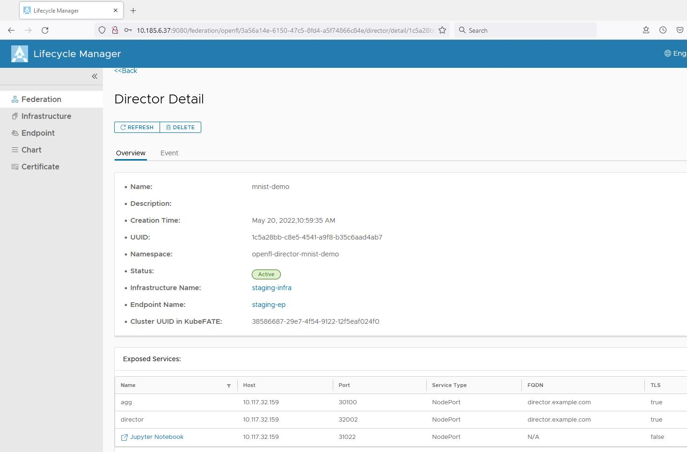

# Managing OpenFL Federations

This document provides an end-to-end guide to set up an OpenFL federation using FedLCM service. Currently, director-based mode is supported.
The overall deployment architecture is in below diagram:

<div style="text-align:center">

</div>

The high-level steps are

1. FedLCM deploys the KubeFATE service into a central K8s cluster and use this KubeFATE service to deploy OpenFL director component, which includes a director service and a Jupyter Lab service.
2. On each device/node/machine that will do the actual FML training using their local data, a device-agent program is launched to register this device/node/machine to FedLCM. The registration information contains a KubeConfig file so the FedLCM can further operate the K8s cluster on the device/node/machine.
3. FedLCM deploys the KubeFATE service and the OpenFL envoy components onto the device/node/machine's K8s cluster.
4. the envoy is configured with the address of the director service, so it will register to the director service upon started.

> Currently the core images for FedLCM's OpenFL federations are not made public yet, please talk with the maintainer for the access details.

## Prerequisite

* Basic understanding of the [director-based](https://openfl.readthedocs.io/en/latest/running_the_federation.html#director-based-workflow) workflow of the OpenFL project.
  * Especially concepts like `shard descriptor`, `expermient` and its API, etc.
* Kubernetes clusters should be created for both the director and each device/node/machine.
  * In a typical setup, the K8s cluster for running director should be a cluster in a central place like a datacenter, cloud environment, etc.
  * The K8s cluster for running envoy can be a lightweight instance like K3s, in each device/node/machine.

## Running FedLCM Service

### Deployment
The FedLCM service can be deployed via docker-compose or in a K8s cluster. Refer to the [README](../README.md) doc for the steps. As currently OpenFL support in FedLCM is in experimental phase, we need to set `LIFECYCLEMANAGER_EXPERIMENT_ENABLED` to `true` to enable it when running FedLCM.

After deploying the FedLCM, access the web UI from a browser:
<div style="text-align:center">

</div>

The login credential can be configured via modifying the docker-compose yaml or the k8s_deploy yaml. The default is Admin:admin.

### Configure the CA service

The FedLCM service depends on a CA service to issue certificates for the deployed components. To configure one, go to the Certificate section and click "NEW" button.
Currently, this service can work with a StepCA server. And both the docker-compose deployment and the K8s deployment contains a built-in StepCA server that can be used directly.

<div style="text-align:center">

</div>

Click "SUBMIT" to save the CA configuration.

## Deploy Director

With the service running and CA configured, we can start create the OpenFL federation. This includes the following steps:

1. Add the information of the Kubernetes cluster where the director will run on to the FedLCM.
2. Create a KubeFATE endpoint service in the target Kubernetes cluster.
3. Create OpenFL federation entity.
4. Create OpenFL director.

### Add Kubernetes Infrastructure

Kubernetes clusters are considered as Infrastructures in the FedLCM service. All the other installation are performed on these K8s clusters. To deploy the director, one must firstly add the target K8s into the system.
Go to the "Infrastructure" section and click the "NEW" button. What needs to be filled is the KubeConfig content that FedLCM will use to connect the K8s cluster.

**Even though for FATE we can support namespace-wide admin, the user configured in the KubeConfig for OpenFL should have the privilege to create all core K8s resource including namespace, deployment, configmap, role, secret, etc. We haven't tested the exact rules. If not sure, use the cluster-admin ClusterRole**

<div style="text-align:center">

</div>

Click "TEST" to make sure the cluster is available. And "SUBMIT" to save the new infrastructure.

The "FATE Registry Configuration" section is for FATE usage and not for OpenFL, we can omit that here.

### Install KubeFATE Endpoint

In the "Endpoint" section, we can install KubeFATE service onto the K8s infrastructure. And later it can be used to deploy OpenFL components.
To add a new KubeFATE endpoint, select the infrastructure and the system will try to find if there is already a KubeFATE service running.
If yes, the system will add the KubeFATE into its database directly. If no, the system will provide an installation step as shown below:

<div style="text-align:center">

</div>

Click "GET KUBEFATE INSTALLATION YAML" to get the deployment yaml. We depend on Ingress and ingress controllers to work with the KubeFATE service.
If in the Kubernetes cluster there is no ingress controller installed, we can select "Install an Ingress Controller for me" to ask FedLCM to install one.

<div style="text-align:center">

</div>

You can make changes to the yaml content to further customized your KubeFATE installation, but the default one is typically sufficient.

### Create OpenFL federation

Now, in the "Federation" page, we can create federations. The federation type is OpenFL. And we can further provide our envoy configurations and shard descriptor python source files if we enable "Customize shard descriptor".

The below screenshot uses a customized setting based on the official [Tensorflow_MNIST](https://github.com/intel/openfl/tree/develop/openfl-tutorials/interactive_api/Tensorflow_MNIST) sample.

<div style="text-align:center">

</div>

In OpenFL's **ORIGINAL** design, the configured shard descriptor is used by envoy for reading and formatting the local data. And when trying to start a new training using the [Experiment API](https://openfl.readthedocs.io/en/latest/running_the_federation.html#experiment-api), users need to implement a `DataInterface` to do batching and augmenting of the data.

This design implies that envoys are ***bounded*** to the logic in shard descriptor, which works with specific dataset. If we want to work with different dataset or format the data into different shape, we need to re-configure the director (with new shape info), re-write the shard descriptor, re-configure the envoy and restart them.


#### Introducing the Unbounded Shard Descriptor for Unbounded Envoy

In FedLCM, by default, "Customize shard descriptor" is not enabled, which provides a more flexible workflow in which envoys are ***Unbounded***.

In such setting, the sample shape and target shape will be set to `['1']`. And envoys in this federation will be configured with below config:

```yaml
shard_descriptor:
  template: dummy_shard_descriptor.FedLCMDummyShardDescriptor`
```

and a shard descriptor python file named `dummy_shard_descriptor.py`
```python
from typing import Iterable
from typing import List
import logging

from openfl.interface.interactive_api.shard_descriptor import DummyShardDescriptor

logger = logging.getLogger(__name__)

class FedLCMDummyShardDescriptor(DummyShardDescriptor):
  """Dummy shard descriptor class."""

  def __init__(self) -> None:
    """Initialize DummyShardDescriptor."""
    super().__init__(['1'], ['1'], 128)

  @property
  def sample_shape(self) -> List[str]:
    """Return the sample shape info."""
    return ['1']

  @property
  def target_shape(self) -> List[str]:
    """Return the target shape info."""
    return ['1']

  @property
  def dataset_description(self) -> str:
    logger.info(
      f'Sample shape: {self.sample_shape}, '
      f'target shape: {self.target_shape}'
    )
    """Return the dataset description."""
    return 'This is dummy data shard descriptor provided by FedLCM project. You should implement your own data '
           'loader to load your local data for each Envoy.'
```

Comparing to other specific shard descriptors, this "dummy" one doesn't contain any data reading logic. Instead, the user need to write the whole local data retrieval logic in the `DataInterface`.
This gives the flexibility to use different dataset or different data formatting logic in different experiments, without the need to re-create the director and envoy.

### New Director

After the federation is created, we can create the director. Click "NEW" under the "Server (Director)" section. And follow the steps in the new page.

<div style="text-align:center">

</div>

Several things to note:
* Try to give a unique name and namespace for the director as it may cause some issue if the name and namespace conflicts with existing ones in the cluster.
* It is suggested to choose "Install certificates for me" in the Certificate section. Only select "I will manually install certificates" if you want to import your own certificate instead of using the CA to create a new one. Refer to the OpenFL helm chart guide on how to import existing one.
* Choose "NodePort" if your cluster doesn't have any controller that can handle `LoadBalancer` type of service.
* If your cluster doesn't enable [Pod Security Policies](https://kubernetes.io/docs/concepts/security/pod-security-policy/), you don't have to enable it in the "Pod Security Policy Configuration".

Finally, get the yaml content, verify it is correct and click "SUBMIT". Now, the FedLCM system will start installing the director, which is listed in the corresponding section:

<div style="text-align:center">

</div>

You can click into the director details page and keep refreshing it. If things went normal, its status will be "Active" later.

<div style="text-align:center">

</div>

Now, we can open up the deployed Jupyter Lab system by clicking the Jupyter Notebook link, input the password we just configured and open a notebook we want to use, or create a new notebook where we can write our own code.

* For this example we use the `interactive_api/Tensorflow_MNIST/workspace/Tensorflow_MNIST.ipynb` notebook.
* If the federation is configured with the default Unbounded Shard Descriptor, you can use `interactive_api/Tensorflow_MNIST_With_Dummy_Envoy_Shard_FedLCM/Tensorflow_MNIST_With_Dummy_Envoy_Shard_FedLCM.ipynb` as an example on how to put real data reading logic in the `DataInterface`.

The content in the notebook is from OpenFL's [official repo](https://github.com/intel/openfl/tree/develop/openfl-tutorials). We assume you have basic knowledge on how to use the OpenFL sdk to work with the director API.

For the `federation` creation part, most of the examples are using below code:

```python
# Create a federation
from openfl.interface.interactive_api.federation import Federation

# please use the same identificator that was used in signed certificate
client_id = 'api'
cert_dir = 'cert'
director_node_fqdn = 'localhost'
director_port=50051
# 1) Run with API layer - Director mTLS 
# If the user wants to enable mTLS their must provide CA root chain, and signed key pair to the federation interface
# cert_chain = f'{cert_dir}/root_ca.crt'
# api_certificate = f'{cert_dir}/{client_id}.crt'
# api_private_key = f'{cert_dir}/{client_id}.key'

# federation = Federation(
#     client_id=client_id,
#     director_node_fqdn=director_node_fqdn,
#     director_port=director_port,
#     cert_chain=cert_chain,
#     api_cert=api_certificate,
#     api_private_key=api_private_key
# )

# --------------------------------------------------------------------------------------------------------------------

# 2) Run with TLS disabled (trusted environment)
# Federation can also determine local fqdn automatically
federation = Federation(
    client_id=client_id,
    director_node_fqdn=director_node_fqdn,
    director_port=director_port, 
    tls=False
)
```

But we actually don't need that to be this complicated, since we have internally configured the SDK to work with the deployed director by default.
So to create a federation that represent the director, use below code is sufficient:

```python
# Create a federation
from openfl.interface.interactive_api.federation import Federation

federation = Federation()
```

And if we call the federation's `get_shard_registry()` API, we will notice the returned data is an empty dict. It is expected as current there is no "client (envoy)" created yet.
We can move on now.

## Register Device/Node/Machine to the Federation

We've designed and implemented a token based workflow to help the deployment of the envoy on a device/node/machine.
As mentioned in the prerequisite section, a K8s cluster needs to be up and running on the device/node/machine.

The overall workflow is:

1. Create a registration token in the federation page.
2. Run `openfl-device-agent` program on the device/node/machine with the token and the FedLCM's address/ 

That's it! In the federation detail page we will notice an envoy is created, and eventually it will register to the director. 

### Create Registration Token

In the "Client (Envoy)" section, switch to the "Registration Token" tab and click the "NEW" button to create a new one.
Some attributes can be configured like expiration date, limit (how many times it can be used), labels (that will be assigned to envoys using this token), etc.

<div style="text-align:center">

</div>

Once a token is created, we can get the token string (staring with the `rand16:` prefix) from its detailed info section.
This token string needs to be distributed to the device/node/machine for future use.

We can create more tokens with different properties like different labels to cope with different requirements.

### The `openfl-device-agent` Program

To have the envoy deployed on it, the device/node/machine needs to run a command line program called `openfl-device-agent`, who will consume the generated token.

The binary of `openfl-device-agent` can be downloaded from the release page or built directly from the source (invoke `make openfl-device-agent` in the source tree of this project).

The program provides two subcommand `register` and `status`. The help message of these subcommands contains basic introduction. And there are more detailed related to some options:

#### The `--envoy-config` option

Provides the path to a file that will be used as the envoy config for this envoy, overriding the envoy config settings in the federation in FedLCM.

#### The `--extra-config` option

Provides the path to a file containing extra configuration for this envoy, in yaml format. The complete configurable yaml content can be:

```yaml
name: "type: string, default: envoy-<ip address of the machine>"
description: "type: string, default: <empty string>"
namespace: "type: string, default: <federation name>-envoy"
chartUUID: "type: string, default: <the default chart uuid in FedLCM>"
labels: "type: map, default:<nil>, the labels for the envoy will be a merge from this field and labels of the token"
skipCommonPythonFiles: "type: bool, default: false, if true, the python shard descriptor files configured in the federation will not be used, and user will need to manually import the python files."
enablePSP: "type: bool, default: false, if true, the deployd envoy pod will have PSP associated"
registryConfig:
  useRegistry: "type: bool, default false"
  registry: "type: string, default <empty string>, if set, the image will be <registry>/fedlcm-openfl:v0.1.0"
  useRegistrySecret: "type: bool, default false"
  registrySecretConfig:
    serverURL: "type: string, the address of the registry, for example, https://demo.goharbor.io"
    username: "type: string"
    password: "type: string"
```

### Start Registration and Envoy Deployment 

Assume on the device/node/machine we have the `openfl-device-agent` program, we can start the registration process

```
openfl-device-agent register -s 10.185.6.37 -p 9080 -t rand16:4MwELPk12Q3ybz9J -w
```

The `-w` option lets the program wait until the registration is finished. Alternatively, we can use the `status` subcommand to check the status of the registration process.
We can add more options to customize the envoy, as described in previous section.

If everything goes well, the output would look like:

```
INFO[0000] New Envoy is being prepared, UUID: 37ae2ac4-321f-4fab-8892-6ff4339d0c18
INFO[0000] Waiting for the preparation to finish
{"level":"info","time":"2022-05-20T05:46:20Z","message":"start for-loop with timeout 1h0m0s, interval 2s"}
INFO[0000] Envoy envoy-10-185-5-155(37ae2ac4-321f-4fab-8892-6ff4339d0c18) status is: Installing Endpoint
INFO[0002] Envoy envoy-10-185-5-155(37ae2ac4-321f-4fab-8892-6ff4339d0c18) status is: Installing Endpoint
INFO[0004] Envoy envoy-10-185-5-155(37ae2ac4-321f-4fab-8892-6ff4339d0c18) status is: Installing Endpoint
INFO[0006] Envoy envoy-10-185-5-155(37ae2ac4-321f-4fab-8892-6ff4339d0c18) status is: Installing Endpoint
INFO[0008] Envoy envoy-10-185-5-155(37ae2ac4-321f-4fab-8892-6ff4339d0c18) status is: Installing Endpoint
INFO[0010] Envoy envoy-10-185-5-155(37ae2ac4-321f-4fab-8892-6ff4339d0c18) status is: Installing Endpoint
INFO[0012] Envoy envoy-10-185-5-155(37ae2ac4-321f-4fab-8892-6ff4339d0c18) status is: Installing Endpoint
INFO[0014] Envoy envoy-10-185-5-155(37ae2ac4-321f-4fab-8892-6ff4339d0c18) status is: Installing Endpoint
INFO[0016] Envoy envoy-10-185-5-155(37ae2ac4-321f-4fab-8892-6ff4339d0c18) status is: Installing Endpoint
INFO[0018] Envoy envoy-10-185-5-155(37ae2ac4-321f-4fab-8892-6ff4339d0c18) status is: Installing Endpoint
INFO[0020] Envoy envoy-10-185-5-155(37ae2ac4-321f-4fab-8892-6ff4339d0c18) status is: Installing Endpoint
INFO[0022] Envoy envoy-10-185-5-155(37ae2ac4-321f-4fab-8892-6ff4339d0c18) status is: Installing Endpoint
INFO[0024] Envoy envoy-10-185-5-155(37ae2ac4-321f-4fab-8892-6ff4339d0c18) status is: Installing Endpoint
INFO[0026] Envoy envoy-10-185-5-155(37ae2ac4-321f-4fab-8892-6ff4339d0c18) status is: Installing Endpoint
INFO[0028] Envoy envoy-10-185-5-155(37ae2ac4-321f-4fab-8892-6ff4339d0c18) status is: Installing Endpoint
INFO[0030] Envoy envoy-10-185-5-155(37ae2ac4-321f-4fab-8892-6ff4339d0c18) status is: Installing Envoy
INFO[0032] Envoy envoy-10-185-5-155(37ae2ac4-321f-4fab-8892-6ff4339d0c18) status is: Installing Envoy
INFO[0034] Envoy envoy-10-185-5-155(37ae2ac4-321f-4fab-8892-6ff4339d0c18) status is: Installing Envoy
INFO[0036] Envoy envoy-10-185-5-155(37ae2ac4-321f-4fab-8892-6ff4339d0c18) status is: Installing Envoy
INFO[0038] Envoy envoy-10-185-5-155(37ae2ac4-321f-4fab-8892-6ff4339d0c18) status is: Installing Envoy
INFO[0040] Envoy envoy-10-185-5-155(37ae2ac4-321f-4fab-8892-6ff4339d0c18) status is: Installing Envoy
INFO[0042] Envoy envoy-10-185-5-155(37ae2ac4-321f-4fab-8892-6ff4339d0c18) status is: Active
INFO[0042] Preparation finished
```

And in the federation page in the FedLCM, we will notice that an envoy is listed:

<div style="text-align:center">

</div>

### Add More Envoys

If we have more devices/machines that we want to join into the federation, perform same actions as above. In this example, we added another device to this federation:
<div style="text-align:center">

</div>

## Run an OpenFL Training Experiment

Switch back to the Jupyter notebook page. If we call the `federation.get_shard_registry()` API again, we will notice now there are envoys registered with their shard descriptor description.
And we can continue the next steps in the notebook, which as described in all the [OpenFL official tutorial](https://openfl.readthedocs.io/en/latest/running_the_federation.html#experiment-api), include defining the `TaskInterface`, `DataInterface` and `ModelInterface`.

If we have more devices/machines that we want to join into the federation, perform same actions as above. In this example, we added another device to this federation:
<div style="text-align:center">

</div>

After calling the `FLExperiment.start()` API, the experiment will be handled by the director and send to all the envoys to start the training. Once it is finished, we can use the `FLExperiment.get_best_model()` and `FLExperiment.get_last_model()` API to get the trained model.
<div style="text-align:center">

</div>


Now, we have finished the whole process of installing FedLCM to deploying OpenFL federation to complete a training experiment!

## Caveats
* If there are errors when running experiment in the envoy side, the experiment may become "never finished". This is OpenFL's own issue. Currently, the workaround is restart the director and envoy.
* There is no "unregister" support in OpenFL yet so if we delete an envoy, it may still show in the director's `federation.get_shard_registry()` API. But its status is offline so director won't send future experiment to this removed envoy.
* For the KubeConfig used in the infrastructure, We haven't tested what are exactly the minimal requirement permissions.