# 使用FedLCM的Site Portal创建FATE任务

目前在FedLCM的Site Portal服务中，我们支持3种不同类型的任务：
1. 建模（modeling）
2. 预测（prediction）
3. 隐私集合求交（PSI）

## 1. 建模

建模的第一步是填充一些基本信息,包括任务名称，任务的描述文字，参与方及数据和标签列名。

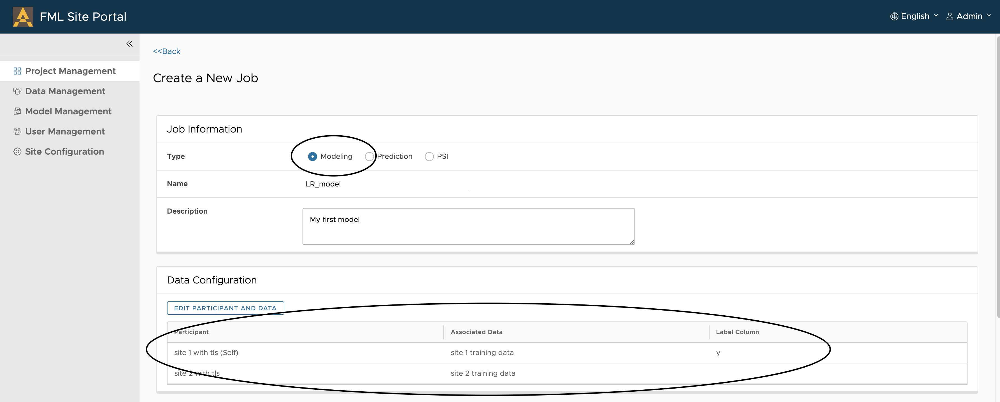

接下来是选择建模的方式和填写模型信息，所需的模型信息根据建模的方式不同也会有所不同。

我们提供两种建模模式，"JSON模板模式"和"交互式"。

### 1.1 JSON模板模式

这种情况下，我们需要填写模型名称，算法和验证数据的比例（可选）。

目前算法支持:
1. Homo Logistic Regression
2. Homo SecureBoost
3. Hetero Logistic Regression
4. Hetero SecureBoost

填写完成后，点击"GENERATE CONFIGURATION", Site Portal后端会根据所选的算法和验证数据比例，基于模版生成相应的Workflow DSL文件和Algorithm Configuration文件。

在这一步，用户可以审阅生成的文件，并根据需求修改模版中的默认参数。

最后点击"SUBMIT"， 此任务便可被提交到FATE-Flow开始执行。

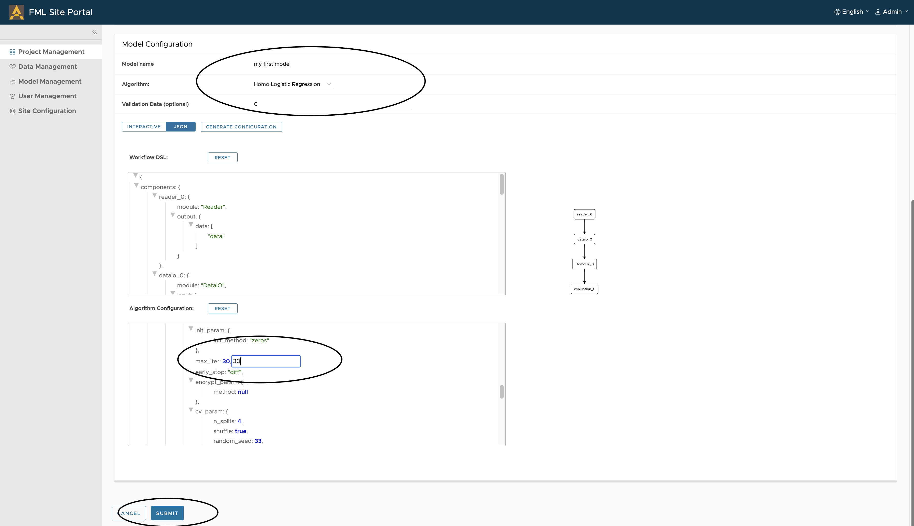

### 1.2 交互式

在交互模式下，我们不需要填写算法和验证数据的比例，只需要填写模型名称

在屏幕的中央有一个画板，我们可以通过拖拽的方式将左边的组件拖拽到画板中完成建模。

在拖拽建模完成后，单击"GENERATE CONFIGURATION"，Site Portal后段服务将根据画板中各组件的连接来生成Workflow DSL文件。

在画板的右侧，单击每个组件时会展示该组件相应的配置选项。单击"GENERATE CONFIGURATION"时， Site Portal后端服务将根据右边的配置生成Algorithm Configuration文件。

配置中有"Common"和"Difference"两种选项，当参与联邦学习的各方该组件的配置都一样时，选择"Common"，否则选择"Difference"。
修改完配置之后需要单击"Save"来进行保存。

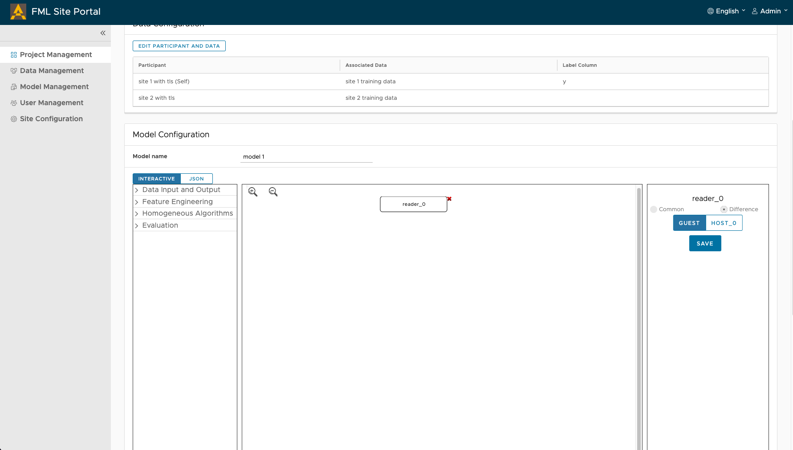

下面将各个组件细述：

#### 1.2.1 Reader组件
此组建必须且默认出现在画板中，它的选项已经固定为"Difference"，这是因为此组件的任务是读取数据，而不同的Party应读取各自的数据。

#### 1.2.2 数据处理组件
**DataIO/DataTransform**：用来做数据的预处理，一般接在Reader下方。在连接组件时，input表示此组件承接的组件，此例子中为"reader_0"(Site Portal前端会自动给每个组件的多个对象进行从0开始的编号)。下面举例说明如何进行连线：

每一个组件可能有多个输出接口，每个接口输出的数据类型可能是data或model。这里"Source"表示一条连接线的开端是上一个组件的哪一个输出接口。

每一个组件也可能有多个输入接口，可能是data或model。这里"Target"表示一条连接线的终端指向的是当前组件的哪个输入接口。

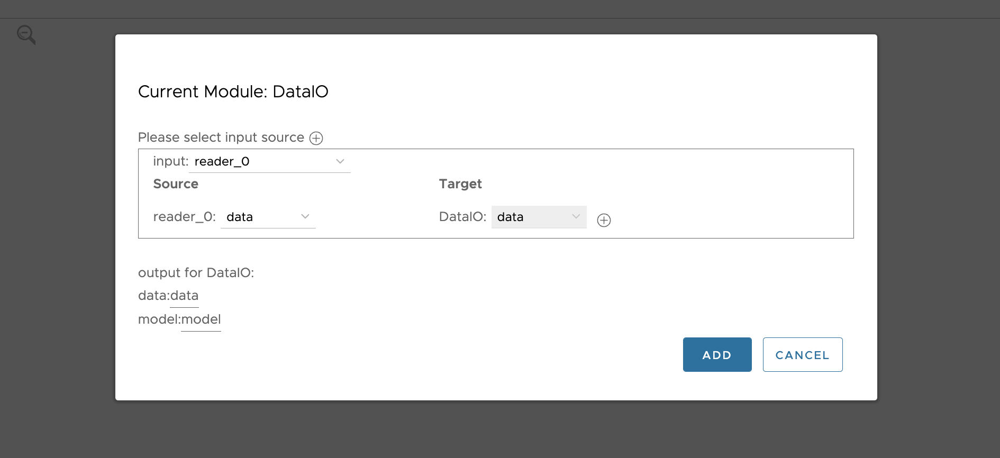

关于此组件各项配置的含义，可参考[此页面](https://fate.readthedocs.io/en/develop-1.6/_build_temp/python/federatedml/util/README.html) 。

> 对于纵向联邦学习任务，请确保Host端的with_label属性为false，guest端的仍为true

**HomoDataSplit**：用来分割数据集，一般接在数据预处理之后。此组件从DataIO组件获取数据，并默认将数据分成3部分：
* train data
* validate data
* test data

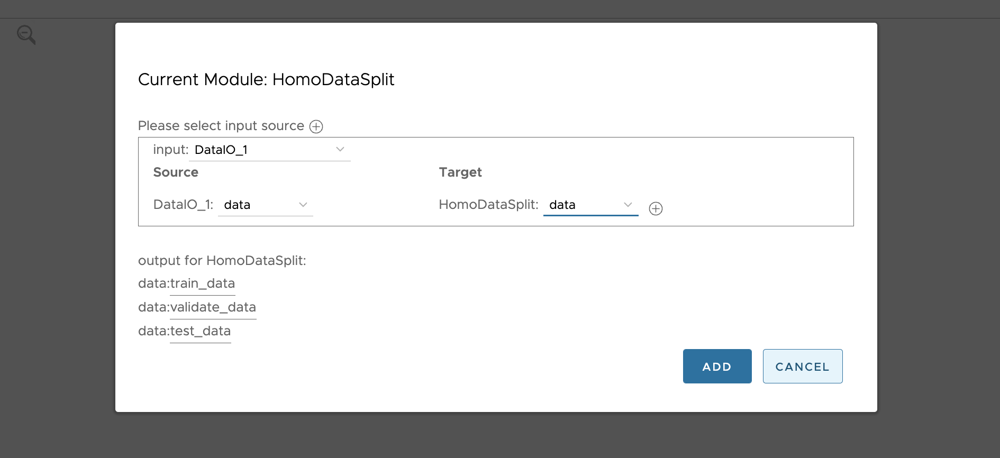

通过调整此组件的配置，可以控制数据分割的比例：

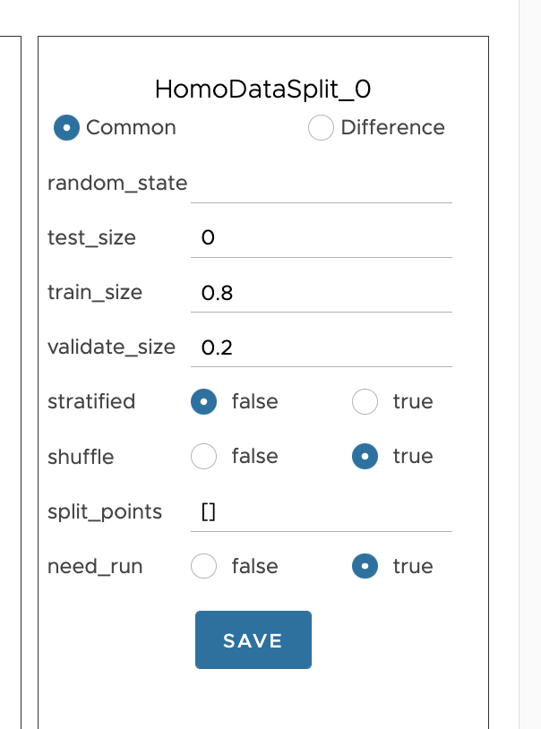

#### 1.2.3 特征工程组件
特征工程组件一般接在"DataIO/DataTransform"组件下方。现阶段我们支持"HomoOneHotEncoder"组件，可以帮助将分类别的特征转化成数字化的特征以便于训练模型。具体配置可以参考[这里](https://fate.readthedocs.io/en/latest/federatedml_component/params/onehot_encoder_param/) 。

特征工程组件下方可以接隐私求交组件和算法组件。

#### 1.2.4 Intersection求交组件
对于纵向联邦学习，我们需要在算法组件之前加入求交组件，该组件使用比较简单，将其拖入图中接入上游组件输出的data即可。

#### 1.2.5 算法组件
算法组件一般接在数据处理组件、特征工程组件和求交组件的下方，下面展示一个例子：

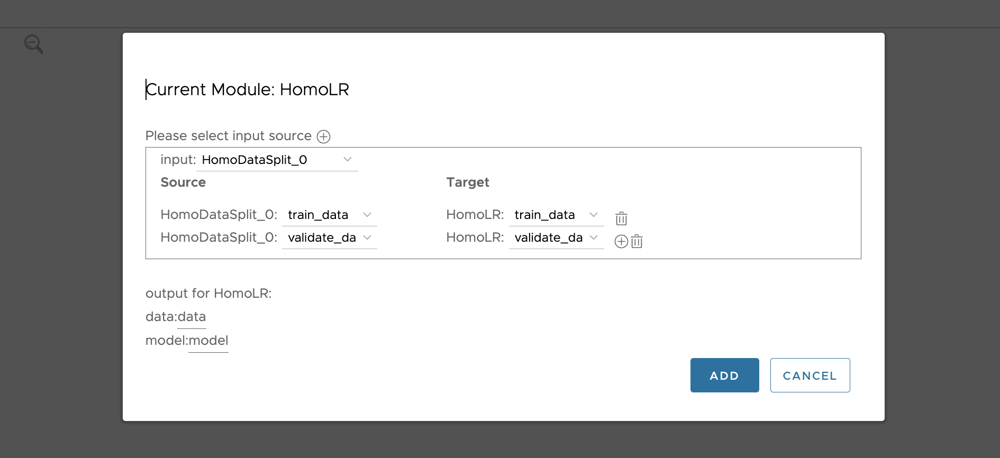

这里我们拖拽了HomoLR这个算法到画板中，将HomoDataSplit分割出的训练数据接入了HomoLR组件的train_data接口；将HomeDataSplit分割出的验证数据接入了HomoLR组件的validate_data接口。

关于每一种算法模块的详细配置及其含义，可以参考[此页面](https://fate.readthedocs.io/en/latest/federatedml_component/#algorithm-list) 。

进入上述页面后，需要根据所使用FATE版本来调整页面的版本，同一算法不同版本间，算法模块的属性可能会有差异。

#### 1.2.6 模型评估组件
模型评估组件负责将模型的评估数据返回给使用者。
模型评估只能接在算法组件的下方，且是画板中DSL的最终节点。

关于模型评估组件的更多信息，可以参考[此页面](https://fate.readthedocs.io/en/latest/federatedml_component/params/evaluation_param/) 。

通过交互式建模，一个典型的且完整的模型将会如下图所示：

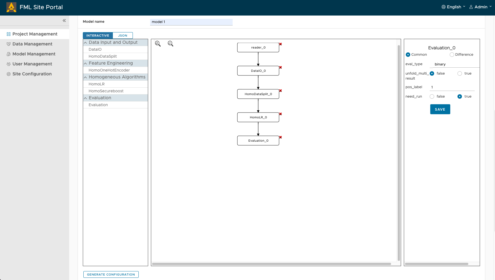

点击"GENERATE CONFIGURATION"，Site Portal后端将会根据画板中的内容生成DSL文件；根据每个组件的配置生成CONF文件。

用户可以审阅生成的文件内容，若没问题，单击"SUBMIT"即可将任务提交到FATE-Flow开始执行。

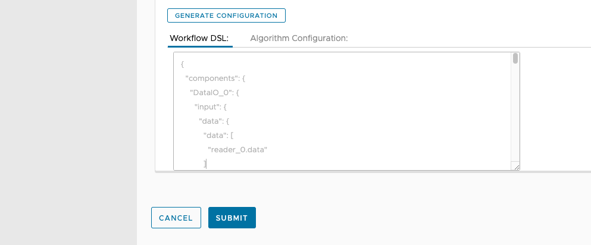

当一个建模任务执行成功时，Site Portal上的任务状态如图例所示：

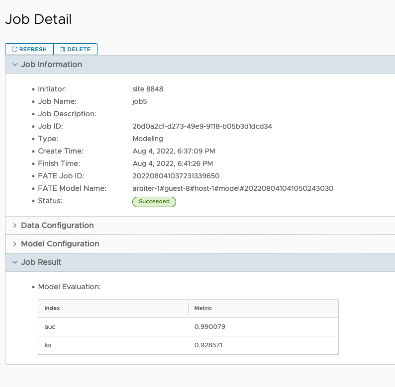

可以登录到Fate-Board上查看更多的任务信息。

## 2. 预测

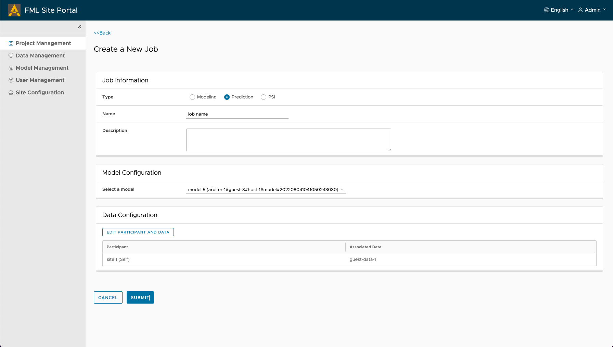

创建一个预测任务需要以下步骤：

1. 填写任务名
2. 选择一个训练好的模型
3. 选择需要被预测的数据集
4. 提交任务

当一个预测任务执行成功时，Site Portal上的任务状态如图例所示：

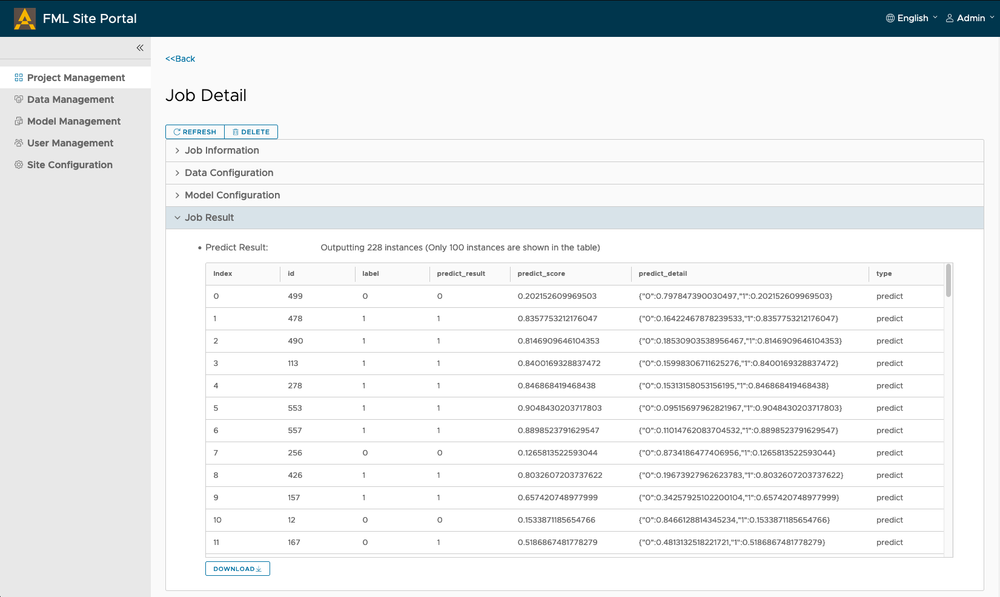

## 3. 隐私集合求交（PSI）

隐私集合求交一般用于纵向联邦学习。例如当两家金融机构可能拥有同一批客户的不同特征时，双方想要扩展各自的特征集来达到更好的训练效果，那首先双方需要知道两边的数据集有多少共同的客户。

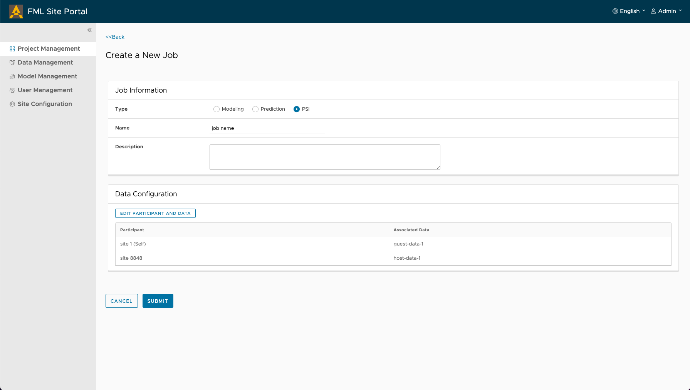

创建一个PSI任务的步骤很简单，只需要填写任务名和参加PSI任务的数据集。

当PSI任务跑完时，我们可以在Site Portal UI上看到结果：
1. 本方数据集有多少实例存在交集
2. 交集占本方数据集总样本数的比例

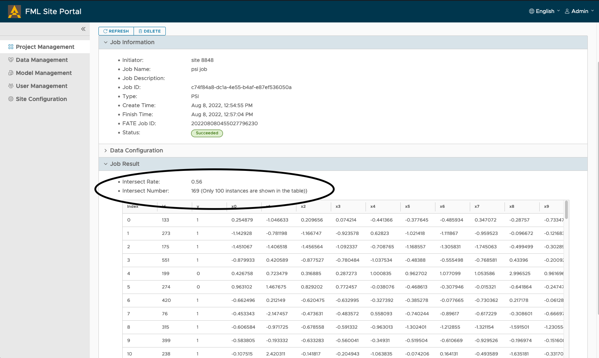

关于PSI的更多信息，可以查看[这里](https://fate.readthedocs.io/en/develop/_build_temp/python/federatedml/statistic/intersect/README.html) 。