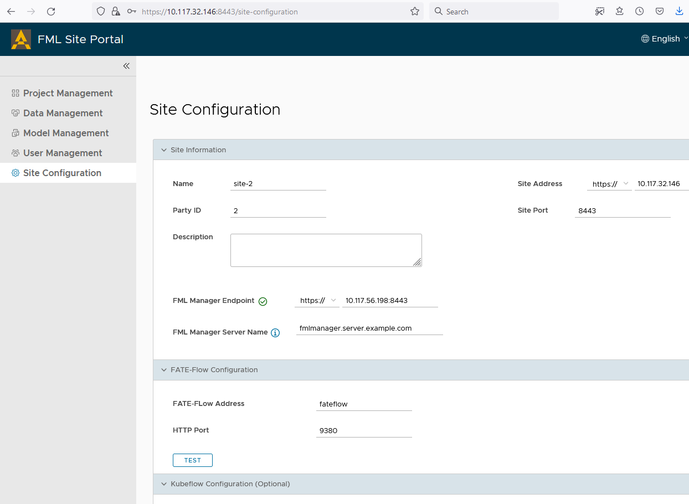

# User Guide for Site Portal in FedLCM
Site Portal is a service to help users facilitate the FATE related workflows, including uploading local data, creating projects and inviting other sites, creating jobs and doing auditions and approvals, all via a Web UI interface. The current FedLCM service can provision FATE federations with Site Portal support, meaning each FATE cluster created by FedLCM can have a Site Portal service running along with the core FATE system like FATE-Flow and others.

This guide provides a step-by-step guide on how to use the Site Portal provisioned by FedLCM to complete FATE related tasks.

>Site Portal is currently an experimental service and may include features that are in alpha or beta state.

## Deploy
You can follow the FedLCM [getting started guide](./Getting_Started_FATE.md) to create FATE federations. **In order to use the Site Portal service, you must deploy the v1.6.1 version of FATE exchange and FATE clusters.** This means in the "Select a Chart" step when creating a new exchange and cluster, you must select the "chart for FATE exchange v1.6.1 with fml-manager service" and "chart for FATE cluster v1.6.1 with site-portal", respectively.

In the below example, we have created a federation with 3 clusters, all containing a Site Portal service.

Looking at the detail information page of each cluster, we can see there is a hyperlink in the "Exposed Service" section leading us to the "Site Portal" page of each site.

## Configure Site Information
Firstly, log in with the credentials. If we didn't change such settings during the cluster deployment, the default credentials are `Admin:admin` and `User:user`. And the first thing we need to do after login is to configure this site on the "Site Configuration" page. For site 1 in this example, we input the settings as in below example:

Several things to note:
1. The FML Manager endpoint address should be the value of the exposed FML Manager service address. And the port number should be included in the address field. We can get such information from the FedLCM's exchange details page, as the FML Manager is deployed in the exchange, as shown in the below picture. 

2. The Site Portal external address should just be the address and port of this Site Portal service, i.e., the address your browser currently is using.
3. The FATE-Flow address can be just "fateflow" and the port be "9380". You can click the "TEST" button to make sure we can connect to it.
4. We don't need to configure the Kubeflow config for now - it is a placeholder for future features.

Before registering this Site Portal to FML Manager, we need to save the configuration. And then, we click the register button to connect to the FML Manager. Make sure we can successfully connect to it before proceeding to the next steps. A green check mark next to the FML Manager address can indicate we have finished the registration. 

For other Site Portals in other parties, we need to perform the same action for each of them and make sure they too can connect to the FML Manager. Below is the example settings for site 2.

## Upload Local Data
CSV files can be uploaded to the system via the "Data Management" page. In this example, we use the FATE [official data](https://github.com/FederatedAI/FATE/blob/v1.6.1/examples/data) to demonstrate the workflow. Site Portal needs to upload the data to the FATE cluster, so the "Upload Job Status" field of each data is the status of the "uploading to FATE" job.
> Only data in "Succeeded" status can be used in future FATE training and predicting jobs.

We uploaded the [guest data](https://github.com/FederatedAI/FATE/blob/v1.6.1/examples/data/breast_homo_guest.csv) and [test data](https://github.com/FederatedAI/FATE/blob/v1.6.1/examples/data/breast_homo_test.csv) to site 1 and [host data](https://github.com/FederatedAI/FATE/blob/v1.6.1/examples/data/breast_homo_host.csv) to site 2, as shown below.

## Create Project
Once created on the "Project Management" page, this project can be viewed as a "local" project. Its information will not be sent to FML Manager, until we invite other parties to join this project.

## Invite Other Parties
Ensure other parties' FATE cluster and Site Portal are deployed and configured, as introduced in the above sections. In the participant management tab, view other registered participants and send invitations to others. In this example, we invite site 2 from site 1.

Then site 2 will list the invitation, and users of that party can choose to join or reject it.

## Associate Data
All parties can associate their local data with the current project from the data management page. In this guide, both site 1 and site 2 have associated their local data with the example project.

>When the data association changes, all participating parties should see the updated information.

## Start Jobs
In the "job management" tab, one can create a new FATE job with other parties. We provide two modes to create FATE jobs: interactive (Drag-n-Drop) and JSON template. In this example, site 1 has created a training job to train a HomoLR model using its and site 2's data. We use the interactive mode to draw the pipeline and click the "GENERATE CONFIGURATION" button to get the DSL and Conf. Then submit it.

The job will start after all participants have approved to start it. In this example, once site 2 approves it, the job will be submitted to FATE-Flow. We can view the job status from FATEBoard, by accessing the ingress address of it (which is listed on FedLCM's FATE cluster detail page).

> All the joined parties can initiate new jobs.

## Work with Trained Models
Modeling job will generate trained models that can be viewed in the "model management" tab in the project or the "model management" page on the main page. And they can be used in the "prediction" type of job. In this guide, we can start a predicting job in site 1 using the test data.

> Currently, the publish function will return an error as FATE v1.6.1 does not support such an operation. This is a placeholder for future integration with newer FATE versions.

> In the job detail page, we may fail to download the complete predicting result. It is a known issue in FATE-Flow and will be fixed in future releases.

## Other Operations
* All parties can dismiss their data association so it won't be used for future jobs.
* Project participants can leave the joined project if they no longer want to participate.
* Project managing participant can close the project if it is no longer needed.
* The "User Management" page provides some configurations to set user permissions for accessing FATE Jupyter Notebook and FATEBoard. But currently it is not implemented yet. It is a placeholder for future integrations.
