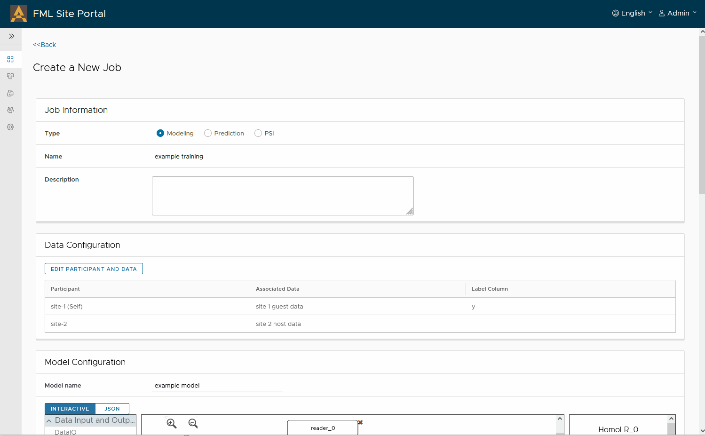
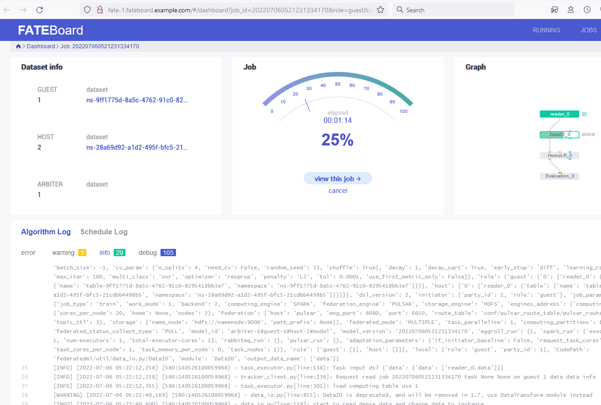
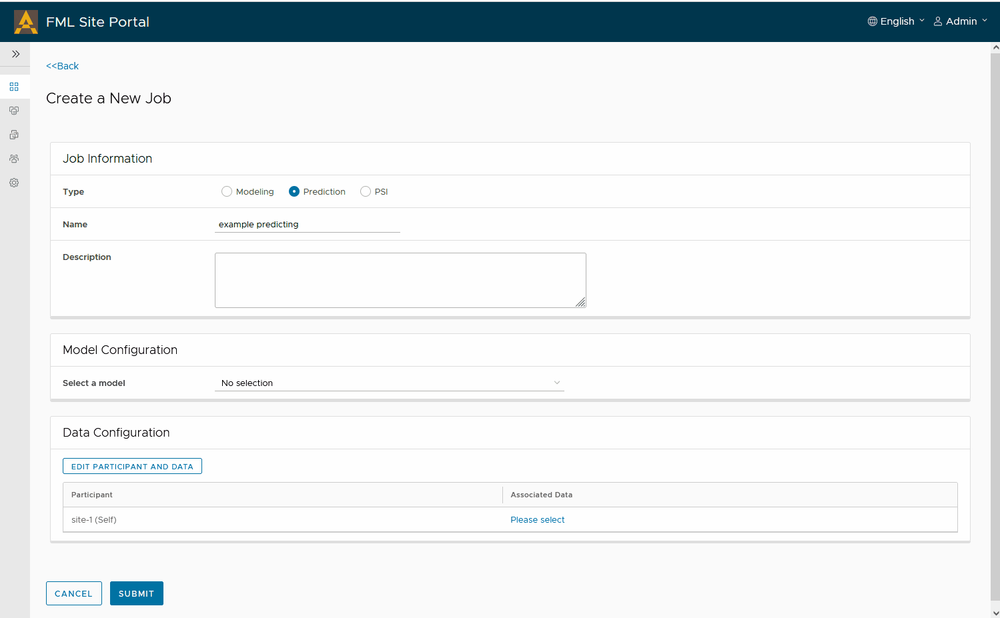

# 使用FedLCM部署的Site Portal服务
Site Portal服务用于帮助用户以图形化的方式使用FATE，提供包括上传本地数据、创建项目并发出邀请，建立合作任务等功能。当前的FedLCM服务部署出的联邦带有Site Portal的支持，也就是说，每一个由FedLCM部署出来的FATE集群，除了带有包括FATE-Flow在内的FATE系统核心服务外，也都带有一个Site Portal服务。

本文档介绍了如何使用FedLCM部署的Site Portal服务，来完成FATE相关的各类任务。

>Site Portal服务目前还处于早期阶段，提供一些基本功能的简单实现。

## 部署
我们可以根据[FedLCM的文档创建FATE的联邦](#todo)，**为使用Site Portal服务，部署的FATE exchange和FATE cluster必须为v1.6.1版本**。 也就是说，在“选择Chart”的时候，我们必须选择“chart for FATE exchange v1.6.1 with fml-manager service”以及“chart for FATE cluster v1.6.1 with site-portal”这样的Chart。

在下图的例子中，我们创建的联邦包含3个FATE cluster，每一个cluster都包含有一个Site Portal服务。

当我们点击进入每一个cluster的详情页面时，会看到在“公开服务”一栏有一个“Site Portal”服务的超链接，供我们跳转到Site Portal的服务页面，从而开始后续的工作。

## 配置站点信息
Site Portal已经内置有两个用户，默认用户名密码是`Admin:admin`或者`User:user`。网站的界面语言默认为英语，我们可以在登录之后，通过右上角的菜单切换语言。之后，我们需要去到“站点配置”页面去进行站点的初始化配置。在下图为我们示例环境中Site 1的站点配置：

这里面有几点需要注意：
1. FML Manager终端地址应该是FATE exchange中暴露出来的FML Manager服务的地址，包括服务的端口号也应该写在此处。各个Site Portal服务需要通过FML Manager完成联邦任务的协调。这个地址的连接信息可以在FedLCM的exchange详情页找到。示例环境的相关信息如下图所示。

2. Site Portal站点地址就是本站点当前的地址和端口，一般来说就是我们当前浏览器地址栏中的地址。
3. 在FATE-Flow地址那里，我们可以写“fateflow”和“9380”即可，我们可以用“测试”按钮确认FATE-Flow工作正常。
4. 我们目前不用配置下面的“Kubeflow配置”栏，这是为了后续功能的保留区域。

在点击“登记”按钮注册到FML Manager之前，我们需要先保存当前配置。之后才能正常注册到FML Manager。当一切正常时，FML Manager终端字样旁边会显示为绿色的对钩。我们只有确保注册成功，才能继续进行下面的操作。

对于其他站点，我们也要进行同样的配置和操作，保证各个站点都已经注册到了FML Manager。下图是示例环境中Site 2的配置。

## 上传本地数据
目前Site Portal支持在数据管理页面上传本地的CSV文件。在本示例中，我们使用[FATE官方仓库中的示例数据](https://github.com/FederatedAI/FATE/blob/v1.6.1/examples/data) 来演示这个过程。“上传任务状态”一栏显示的是Site Portal是否成功将数据导入到FATE系统。
> 只有“已成功”的数据能够继续被用来参与后续的建模和预测任务。

我们将[guest数据](https://github.com/FederatedAI/FATE/blob/v1.6.1/examples/data/breast_homo_guest.csv) 和 [test数据](https://github.com/FederatedAI/FATE/blob/v1.6.1/examples/data/breast_homo_test.csv) 上传到Site 1之中，然后将 [host数据](https://github.com/FederatedAI/FATE/blob/v1.6.1/examples/data/breast_homo_host.csv) 上传到Site 2中。如下图所示

## 创建项目
在“项目管理”页面，我们可以创建新的项目，刚刚创建的项目可以被认为是一个“本地”项目，FML Manager以及其他方还不知道这个项目的信息，只有我们向其他方发出邀请时，项目信息才会被同步过去。

## 邀请其他参与方
如之前所介绍的，其他方的FATE集群的Site Portal服务需要已经正常运行，并配置和注册到了**同一个**FML Manager之中。此时，在“成员管理”页面，项目创建方就可以看到其他的可邀请的成员，并发出邀请了。在本文的例子中，我们再Site 1向Site 2发出邀请。

Site 2的页面中将会展示出这个邀请，它的用户可以选择接受或者拒绝这个邀请。

## 关联数据
项目中的各个参与方可以将它们的本地数据关联到当前项目之中，在本文中，Site 1和Site 2之前上传成功的数据可以被关联到我们刚刚创建的项目之中。

>当数据关联信息发生了改变时，所有参与方都能同步到关联信息的更新。

## 创建任务
在“任务管理”的子页面，我们可以创建新的FATE任务了。我们目前提供2种创建任务的方式，“交互式”或者“JSON”模板模式。在本示例中，Site 1使用自己和Site 2的数据，并通过交互式的托拉拽的方法创建了一个HomoLR的任务，如果我们了解FATE的DSL的组织形式，那么“交互式”的操作步骤并不复杂。在创建了pipeline的图形后，我们点击“生成配置文件”来获得最终的DSL和Conf内容，并点击“提交”。

此时任务处于“等待中”的状态，需要其他参与方接受该任务，任务才能真正被执行。在本示例中，Site 2需要接受该任务，之后任务会被提交到FATE-Flow。在提交之后，我们可以通过访问FATEBoard的ingress地址来登录FATEBoard，并查看任务的详细状态和日志。FATEBoard的Ingress地址同样在FedLCM的cluster详情页中有展示。

> 项目中的所有参与方都可以作为发起方发起新的任务。

关于创建任务的更加详细的步骤，我们有单独的[文档](/doc/Site_Portal_Create_Job_Guide_zh.md)进行更详细的展示。

## 使用训练好的模型
训练任务将会产生训练好的模型，并展示在项目的“模型管理”子页面中以及“模型管理”一级页面中。而预测任务可以使用这些训练好的模型。在下图中，我们再Site 1这边使用训练好的模型来对test数据进行预测。

> 目前，“发布”模型功能还没有完全支持。

> 在预测任务的详情页面，我们可能还不能下载完整的预测结果，这是FATE-Flow本身与HDFS结合时的问题导致的，后续这个问题将会得到修复。

## 其他操作
* 项目的各个参与方可以取消自己的数据关联，取消之后，各方将无法使用已经取消关联的数据创建新的任务。
* 如果不想继续参与已经加入的某个项目，项目的各个参与方也可以选择离开该项目。
* 项目的发起方可以直接关闭项目，所有参与方都将无法继续在项目中进行进一步的操作。
* “用户管理”页面提供一些简单的用户权限管理界面，分别用户控制用户是否能访问Jupyter Notebook以及FATEBoard等服务，不过目前该功能还未完全开放。
