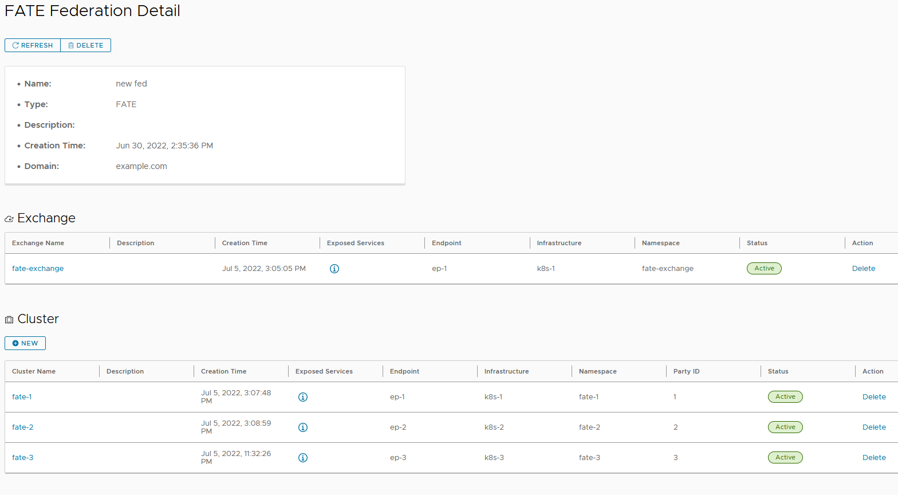
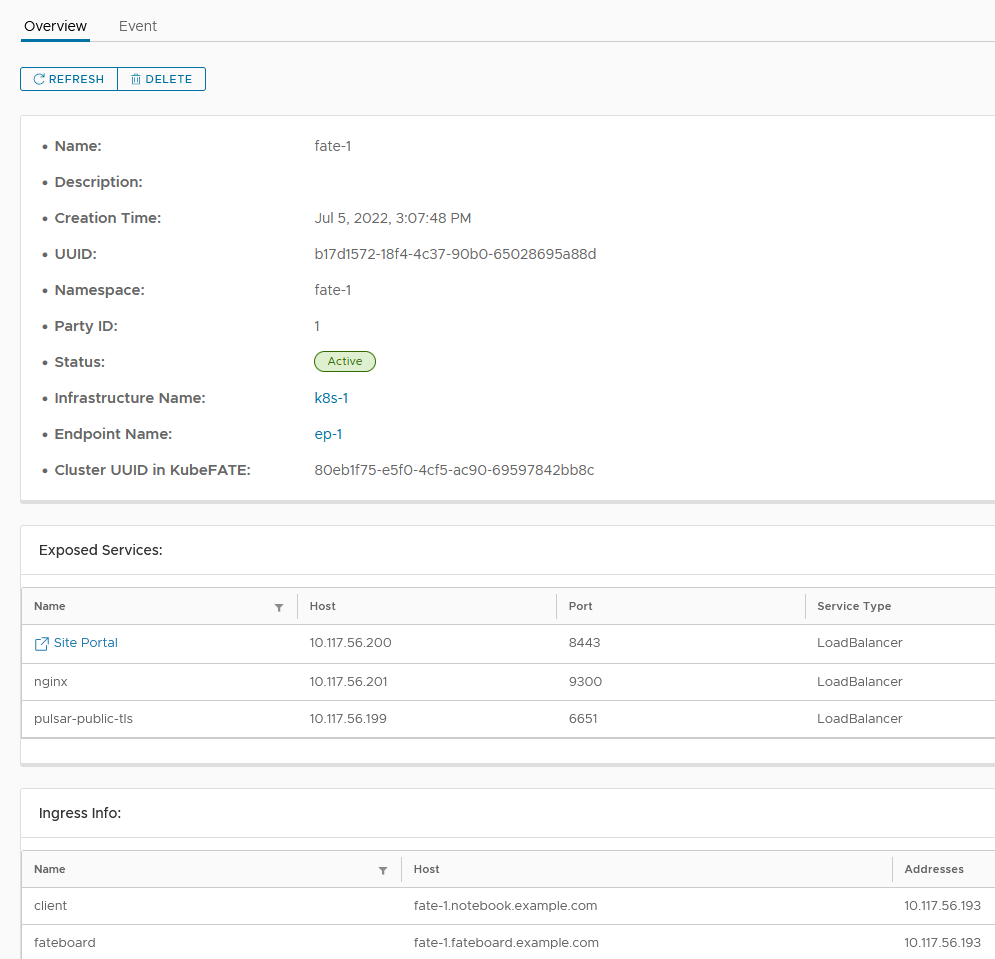
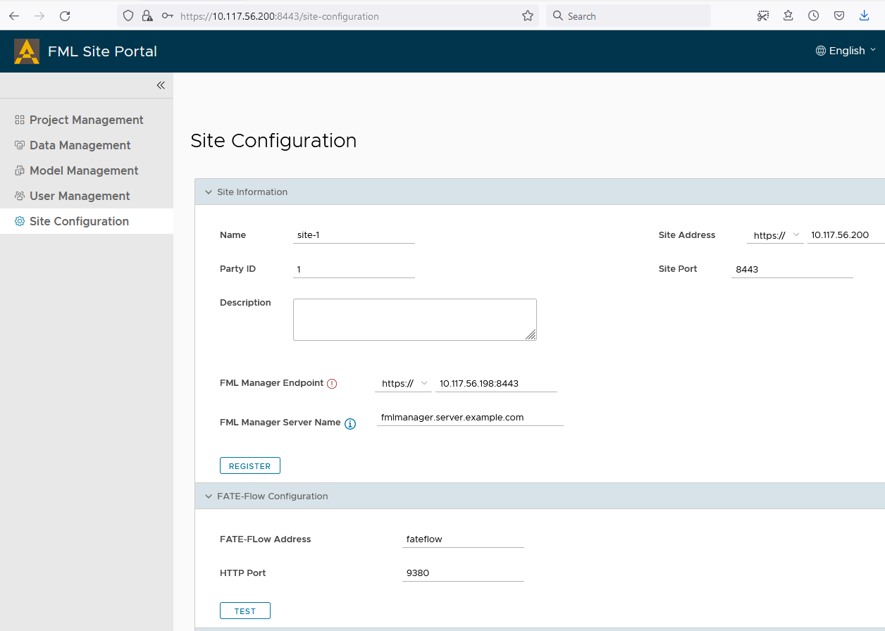

# 如何配置FedLCM部署的Site Portal站点

Site Portal服务用于帮助用户以图形化的方式使用FATE，提供包括上传本地数据、创建项目并发出邀请，建立合作任务等功能。当前的FedLCM服务部署出的联邦带有Site Portal的支持，也就是说，每一个由FedLCM部署出来的FATE集群，除了带有包括FATE-Flow在内的FATE系统核心服务外，也都带有一个Site Portal服务。

关于Site Portal的详细说明和使用介绍，可以参考[Site Portal的介绍文档](./Site_Portal_Manual_zh.md)。由于Site Portal需要通过FML Manager服务与其他参与方的Site Portal交互，本文档主要介绍了如何对FedLCM部署的Site Portal进行配置，以完成各方的互相连接。

>Site Portal服务目前还处于早期阶段，提供一些基本功能的简单实现。

## 部署

我们可以根据[FedLCM的文档创建FATE的联邦](./Getting_Started_FATE_zh.md)，**为使用Site Portal服务，部署的FATE exchange和FATE cluster必须为v1.9.1版本**， 也就是说，在“选择Chart”的时候，我们必须选择“chart for FATE exchange v1.9.1 with fml-manager service”以及“chart for FATE cluster v1.9.1 with site-portal”这样的Chart。

在下图的例子中，我们创建的联邦包含3个FATE cluster，每一个cluster都包含有一个Site Portal服务。

当我们点击进入每一个cluster的详情页面时，会看到在“公开服务”一栏有一个“Site Portal”服务的超链接，供我们跳转到Site Portal的服务页面，从而开始后续的工作。

## 配置站点信息

Site Portal已经内置有两个用户，默认用户名密码是`Admin:admin`或者`User:user`。网站的界面语言默认为英语，我们可以在登录之后，通过右上角的菜单切换语言。之后，我们需要去到“站点配置”页面去进行站点的初始化配置。

从v0.2.0 Release开始，FedLCM会在部署好Site Portal之后，尝试自动对其进行配置并自动注册到FML Manager之中，如果您在站点配置页面看到当前站点已经注册成功，那可以忽略本节内容，直接进行下一节的内容。有时，FedLCM的自动配置过程可能失败，那么此时我们需要根据如下示例手动进行Site Portal的配置。

在下图为我们示例环境中Site 1的站点配置：

这里面有几点需要注意：

1. 如果FML Manager也是由FedLCM在部署FATE exchange时创建的，那么FML Manager终端地址那里应该是FATE exchange中暴露出来的FML Manager服务的地址，包括服务的端口号也应该写在此处。各个Site Portal服务需要通过FML Manager完成联邦任务的协调。这个地址的连接信息可以在FedLCM的exchange详情页找到。示例环境的相关信息如下图所示。

2. Site Portal站点地址就是本站点当前的地址和端口，一般来说就是我们当前浏览器地址栏中的地址。
3. 在FATE-Flow地址那里，我们可以写“fateflow”和“9380”即可，我们可以用“测试”按钮确认FATE-Flow工作正常。
4. 我们目前不用配置下面的“Kubeflow配置”栏，这是为了后续功能的保留区域。

在点击“登记”按钮注册到FML Manager之前，我们需要先保存当前配置。之后才能正常注册到FML Manager。当一切正常时，FML Manager终端字样旁边会显示为绿色的对钩。我们只有确保注册成功，才能继续进行下面的操作。

对于其他站点，我们也要进行同样的配置和操作，保证各个站点都已经注册到了FML Manager。下图是示例环境中Site 2的配置。

## 开始使用Site Portal

在各个Site Portal配置完成之后，我们可以根据[Site Portal的介绍文档](./Site_Portal_Manual_zh.md)进行后续的数据管理、项目管理、任务管理等。

