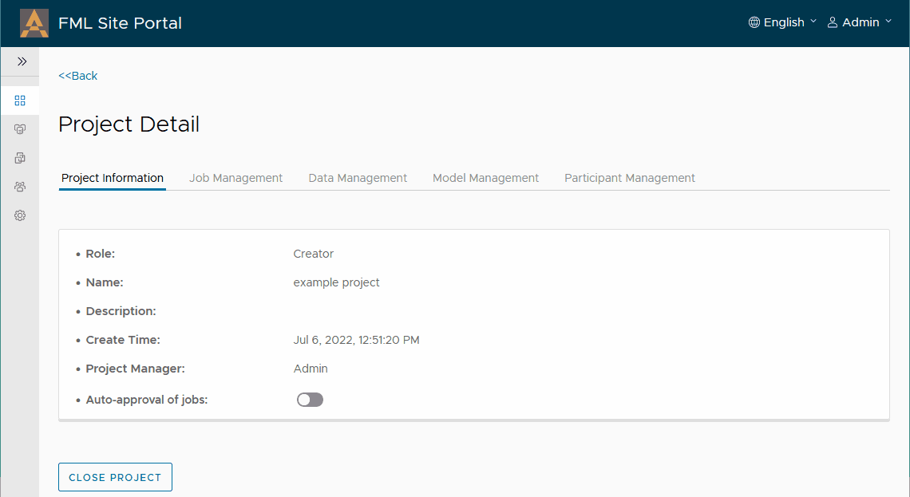

# Site Portal使用手册

## 1. 介绍

Site Portal系统为每个FATE提供了一套图形化的管理界面，通过该界面用户可以：

* 将本地数据上传到FATE系统中，或纳管FATE系统中已存在的Table。
* 创建项目，并通过FML Manager系统邀请其他方的Site Portal加入项目。
* 各个参与方可以将各自的数据关联到项目中。
* 项目各方可以使用关联的数据，以图形化的方式创建训练任务，PSI任务，并使用训练好的模型创建预测任务。

后续，Site Portal还将支持将训练好的模型发布到FATE-Serving或KServe（KFServing）系统中，创建在线推理的服务。

在一个多方参与的联邦学习"联邦"中，各方的Site Portal通过FML Manager进行互联，并调用各自的FATE系统完成FATE任务。如下图所示：

<div style="text-align:center">

</div>

其中：

* FML Manager可以部署在可信的第三方，或某一方之中，一个联邦只需要**一个**FML Manager服务。
* 所有的Site Portal服务需要注册到该FML Manager中，以便发现其他方和互联。
* FML Manager与Site Portal的连接可以使用基于TLS的双向证书进行互相验证。
* 一个Site Portal服务包含一个前端服务、一个后端服务和一个数据库服务。
* FML Manager包含一个后端服务和一个数据库服务。目前不提供前端界面。

目前，Site Portal已经验证可以与FATE v1.9一起工作（Spark和EggRoll等基础引擎均支持）。技术上其也应可以与v1.8、v1.7以及未来的v1.x版本一起工作。欢迎社区用户帮助我们进行验证和反馈。下一节我们将介绍如何快速运行Site Portal，并完成一个联邦任务。

## 2. 部署与站点配置

### 2.1 使用FedLCM部署

我们推荐使用FedLCM来部署FATE系统和Site Portal服务，其中，FedLCM部署的Exchange内带有一个FML Manager服务，而各个FATE集群内则各有一个Site Portal服务，如下图所示：

<div style="text-align:center">

</div>

关于通过FedLCM部署和配置Site Portal的详细介绍，可以参考[这篇文档](./Site_Portal_In_FedLCM_Configuration_Guide_zh.md)，本文不再赘述。

### 2.2 通过Docker Compose部署

**系统要求**：安装有 docker 18+ 以及 docker-compose 1.28+ （建议为2.x或以上）的 Linux 系统

从v0.2开始，Site Portal和FML Manager可以单独通过Docker Compose部署，由于Site Portal不会对FATE系统的互联进行配置，因此在这种部署方式下，为正常使用Site Portal，我们需要自行部署好各方的FATE系统并完成互联的route table配置。部署FATE系统仍可以[使用FedLCM做到](./Getting_Started_FATE_zh.md)，或者自行通过KubeFATE等其他方式部署。总体来说，通过Docker Compose部署Site Portal包括如下几步：

1. （可选）生成FML Manager的Server和Client证书。
2. 在可信第三方或联邦各方都认可的一方，通过docker-compose运行FML Manager。
3. （可选）为各方Site Portal生成其Server和Client证书。
4. 在各方使用docker-compose运行Site Portal服务。
5. 在各方的Site Portal中配置FML Manager服务的连接地址并注册。

#### 2.2.1 部署FML Manager

一个FML Manager服务负责互联所有的Site Portal服务，并提供基本的项目、任务信息的同步协调。FML Manager服务一般部署在可信的第三方或各方都认可的某一方中。要部署FML Manager，首先，我们从Releases页面下载`fml-manager-docker-compose-<version>.tgz`文件，并解压到指定文件夹中。或者在本项目中进入fml-manager目录执行后续步骤。后续步骤都是在该指定文件夹或本项目的fml-manager目录中执行。

Site Portal和FML Manager之间通过HTTP请求进行通信，我们推荐在生产环境中启用双向证书（mTLS）来保证互联的安全。

> FML Manager 和所有 Site Portal的证书必须由同一个CA签发。

##### 2.2.1.1 不使用mTLS

如果需要定制镜像地址或版本，需修改`.env`文件，之后，可修改`docker-compose.yml`文件内的默认设定，如暴露的端口号等。之后使用如下命令启动FML Manager：

```bash
docker-compose pull
docker-compose up
```

记录FML Manager的外部地址和端口，用于后续Site Portal的配置。

##### 2.2.1.2 使用mTLS

若要启用双向证书，需要为FML Manager生成其Server证书（用于接受Site Porta请求）和Client证书（用于向Site Portal发送请求）。本文档中我们使用一个StepCA服务签发证书，使用其他工具如OpenSSL等的证书生成方式可参阅相关文档。

1. 请首先运行一个StepCA服务端软件，可参看[StepCA官方文档](https://smallstep.com/docs/step-ca/installation) 。在运行起来后，请将StepCA服务端的CA证书命名为`ca.crt`放入`tls/cert`目录下。我们可以使用如下命令获得CA证书的内容：
```
step ca root
```

2. 之后进入到`tls/cert`目录下，使用如下命令生成对应的证书和私钥（请替换里面的`<CommonName>`（比如fmlmanager.example.com）和`<CertValidTime>`（比如8760h）为我们想要设置的值）：

```
step ca certificate <CommonName> --san localhost --san <ServerName> server.crt server.key --not-after=<CertValidTime>

step ca certificate <CommonName> client.crt client.key --not-after=<CertValidTime>
```

* 生成Server证书时，必须加上`localhost`作为SAN之一，这是因为FML Manager会以这个地址调用自己内部的服务。
* 生成Server证书时，必须包含一个`<ServerName>`作为SAN之一，Site Portal连接FML Manager时将会验证这个域名。
* `<CommonName>`目前可以自行定义，当前各服务对该值内容不做要求。
* 我们也可以根据需求加入其他地址或域名，作为其他的SAN的值。

**如果我们使用其他工具或者服务来生成证书，那么如下几点需要注意**

* Server证书的SAN中需要`localhost`以及一个合法的`<ServerName>`。
* Server端的证书文件为`server.crt`和`server.key`。Client端的证书文件为`client.crt`和`client.key`。这几个文件都应和CA的证书`ca.crt`一起放入`tls/cert`目录下。

在准备好证书文件后，我们同样可以修改`.env`文件指定镜像配置，同时可以修改`docker-compose-https.yml`文件修改默认端口号等内容。之后使用如下命令启动带有mTLS功能的FML Manager：

```bash
docker-compose -f docker-compose-https.yml up
```

同样，我们需要记录FML Manager的外部地址和端口，用于后续Site Portal的配置。

> 当前FML Manager不提供UI界面，其暴露的地址和端口只接受Site Portal的调用。

#### 2.2.2 部署Site Portal

每个参与方都需要部署一套Site Portal服务，并与前述的FML Manager连接。要部署Site Portal，首先，我们从Releases页面下载`site-portal-docker-compose-<version>.tgz`文件，并解压到指定文件夹中。或者在本项目中进入site-portal目录执行后续步骤。后续步骤都是在该指定文件夹或本项目的site-portal目录中执行。

若FML Manager未启用mTLS，则Site Portal也无需使用mTLS。在这种情况下，直接执行下面的命令来启动Site Portal：

```bash
docker-compose pull
docker-compose up
```

如需修改镜像信息，可在运行`docker-compose`命令前修改`.env`文件，如需修改其他信息，例如当FML Manager与Site Portal运行在同一台机器上时，需要修改绑定的主机端口号以免端口号冲突，可修改`docker-compose.yml`文件之后，再执行`docker-compose up`命令。

默认设置下，我们可以使用`http://<本机地址>:8080`访问不带mTLS功能的Site Portal。如果修改了`docker-compose.yml`中的端口映射，则我们需要访问对应的端口。

若FML Manager已经启用mTLS，则Site Portal也需要启用mTLS。此时我们首先需要为Site Portal生成证书。**注意，为所有Site Portal和FML Manager签发证书的CA需要是同一个CA。** 同样以使用StepCA为例，使用如下命令生成Site Portal的证书：

```
step ca certificate <CommonName> --san localhost --san <ServerName> server.crt server.key --not-after=<CertValidTime>

step ca certificate <CommonName> client.crt client.key --not-after=<CertValidTime>
```

* 生成Server证书时，必须加上`localhost`作为SAN之一，这是因为Site Portal会以这个地址调用自己内部的服务。
* 生成Server证书时，必须包含一个`<ServerName>`作为SAN之一，FML Manager连接Site Portal时将会验证这个域名。
* `<CommonName>`目前可以自行定义，当前各服务对该值内容不做要求。
* 我们也可以根据需求加入其他地址或域名，作为其他的SAN的值。

**如果我们使用其他工具或者服务来生成证书，那么如下几点需要注意**

* 签发证书的CA必须和FML Manager证书的CA是同一个。
* Server证书的SAN中需要`localhost`以及一个合法的`<ServerName>`。
* Server端的证书文件为`server.crt`和`server.key`。Client端的证书文件为`client.crt`和`client.key`。这几个文件都应和CA的证书`ca.crt`一起放入`tls/cert`目录下。

在准备好证书文件后，我们同样可以修改`.env`文件指定镜像配置，同时可以修改`docker-compose-https.yml`文件修改默认端口号等内容。**注意，我们需要修改`SITEPORTAL_TLS_COMMON_NAME`的值为我们为Server证书指定的`<ServerName>`。**

之后使用如下命令启动带有mTLS功能的site Portal：

```bash
docker-compose -f docker-compose-https.yml up
```

默认情况下，我们通过浏览器访问`https://<本机地址>:8443`即可访问到Site Portal的界面。如果我们修改了`docker-compose-https.yml`文件中的端口映射，则需要访问修改的端口。

#### 2.2.3 配置Site Portal

Site Portal已经内置有两个用户，默认用户名密码是`Admin:admin`或者`User:user`。网站的界面语言默认为英语，我们可以在登录之后，通过右上角的菜单切换语言。之后，我们需要去到“站点配置”页面去进行站点的初始化配置。

下图是一个示例的Site Portal配置和相关说明（假设该方为Site 1）：

<div style="text-align:center">

</div>

1. 在FATE-Flow地址那里，我们可以用“测试”按钮确认FATE-Flow工作正常。
2. 在点击“登记”按钮注册到FML Manager之前，我们需要先保存当前配置。之后才能正常注册到FML Manager。当一切正常时，FML Manager终端字样旁边会显示为绿色的对钩。我们只有确保注册成功，才能继续进行下面的操作。

对于其他方的Site Portal，也要进行同样的配置和操作，保证各个站点都已经注册到了FML Manager。下图是示例环境中另一方（我们假设它是Site 2）的配置：

<div style="text-align:center">

</div>

至此，我们已经部署起来了FML Manager服务和Site Portal服务。

## 3. 上传或纳管本地数据

无论是使用FedLCM部署，还是通过Docker Compose单独部署，在部署和配置完成之后，我们可以开始后续的数据、任务管理等流程。首先是各方上传或纳管本地数据。

目前Site Portal支持在数据管理页面上传本地的CSV文件。在本示例中，我们使用[FATE官方仓库中的示例数据](https://github.com/FederatedAI/FATE/blob/v1.9.1/examples/data) 来演示这个过程。“上传任务状态”一栏显示的是Site Portal是否成功将数据导入到FATE系统。

> 只有“已成功”的数据能够继续被用来参与后续的建模和预测任务。

我们将[guest数据](https://github.com/FederatedAI/FATE/blob/v1.9.1/examples/data/breast_homo_guest.csv) 和 [test数据](https://github.com/FederatedAI/FATE/blob/v1.9.1/examples/data/breast_homo_test.csv) 上传到Site 1之中，然后将 [host数据](https://github.com/FederatedAI/FATE/blob/v1.9.1/examples/data/breast_homo_host.csv) 上传到Site 2中。如下图所示

<div style="text-align:center">

</div>

由于本地上传CSV的方式有一定局限性，除此之外，我们也可以通过其他方式将数据导入FATE系统成为一个Table，之后我们可以通过Site Portal纳管这个已存在的Table。同样在数据管理页面，我们可以点击"纳管已存在的Table"来添加数据，我们需要提供该数据在FATE中的Namespace和Table的名字。Site Portal会去验证该数据是否存在，若一切正常，该数据将被Site Portal纳管，可用于后续训练，**通过Site Portal删除数据同样会将数据从FATE系统的存储引擎中删除**。

<div style="text-align:center">

</div>

> 注意，如果FATE系统发生重置或者其中数据已经删除，则Site Portal中对应的数据条目可能已经失效，需要删除后重新上传。

## 4. 创建项目
在“项目管理”页面，我们可以创建新的项目，刚刚创建的项目可以被认为是一个“本地”项目，FML Manager以及其他方还不知道这个项目的信息，只有我们向其他方发出邀请时，项目信息才会被同步过去。

## 5. 邀请其他参与方
如之前所介绍的，其他方的FATE集群的Site Portal服务需要已经正常运行，并配置和注册到了**同一个**FML Manager之中。此时，在“成员管理”页面，项目创建方就可以看到其他的可邀请的成员，并发出邀请了。在本文的例子中，我们在Site 1向Site 2发出邀请。

<div style="text-align:center">

</div>

Site 2的页面中将会展示出这个邀请，它的用户可以选择接受或者拒绝这个邀请。

<div style="text-align:center">

</div>

## 6. 关联数据
项目中的各个参与方可以将它们的本地数据关联到当前项目之中，在本文中，Site 1和Site 2之前上传成功的数据可以被关联到我们刚刚创建的项目之中。

<div style="text-align:center">

</div>

>当数据关联信息发生了改变时，所有参与方都能同步到关联信息的更新。

## 7. 创建任务
在“任务管理”的子页面，我们可以创建新的FATE任务了。我们目前提供2种创建任务的方式，“交互式”或者“JSON”模板模式。在本示例中，Site 1使用自己和Site 2的数据，并通过交互式的托拉拽的方法创建了一个HomoLR的任务，如果我们了解FATE的DSL的组织形式，那么“交互式”的操作步骤并不复杂。在创建了pipeline的图形后，我们点击“生成配置文件”来获得最终的DSL和Conf内容，并点击“提交”。

<div style="text-align:center">

</div>

此时任务处于“等待中”的状态，需要其他参与方接受该任务，任务才能真正被执行。在本示例中，Site 2需要接受该任务，之后任务会被提交到FATE-Flow。在提交之后，我们可以通过访问FATEBoard的ingress地址来登录FATEBoard，并查看任务的详细状态和日志。如果FATE系统是通过FedLCM部署的，那么FATEBoard的Ingress地址同样在FedLCM的cluster详情页中有展示。

<div style="text-align:center">

</div>

> 项目中的所有参与方都可以作为发起方发起新的任务。

关于创建任务的更加详细的步骤，我们有单独的[文档](/doc/Site_Portal_Create_Job_Guide_zh.md)进行更详细的展示。

## 8. 使用训练好的模型
训练任务将会产生训练好的模型，并展示在项目的“模型管理”子页面中以及“模型管理”一级页面中。而预测任务可以使用这些训练好的模型。在下图中，我们在Site 1这边使用训练好的模型来对test数据进行预测。

<div style="text-align:center">

</div>

> 目前，“发布”模型功能还没有完全支持。

## 9. 注销Site Portal

当不再需要使用Site Portal时，各方可以将自己的Site Portal从FML Manager中注销，当注销后，该Site Portal将离开所有已加入的项目，所有该Site Portal关联到的数据也将取消关联。其他方的Site Portal也不能再邀请已经注销的Site Portal。已经注销的Site Portal可以通过站点管理页面重新注册到FML Manager中。

使用FedLCM部署的Site Portal，在通过FedLCM删除整个FATE Cluster时，会自动从FML Manager中注销。如果是单独部署的Site Portal，则有两种方式可以手动将其注销：

### 9.1 从待注销的Site Portal发起
当Site Portal仍在运行时，可以在站点管理页面FML Manager连接信息旁点击"注销"按钮即可。

### 9.2 从FML Manager发起
访问FML Manager的注销API接口，可以将待注销的Site Portal删除。例如：
```bash
curl -X 'DELETE' \
  'http(s)://<fml manager address>/api/v1/site/<site uuid>' \
  -H 'accept: application/json'
```

**但是，这种方式有如下限制和注意事项**

1. 若要访问启用了mTLS的FML Manager的API接口，需要使用客户端证书，且生成证书的CA需与FML Manager的CA一致。生成证书的方式可以参考前文中为Site Portal生成Client证书的方式。
2. 这种注销方式只会把待注销的Site Portal的信息从其他Site Portal以及FML Manager中清除。待注销的Site Portal如果仍在运行，其内部相关信息不会被清除。所以如果待注销的Site Portal仍在运行，请通过9.1节的方式从Site Portal发起注销操作。

## 10. 其他操作

* 项目的各个参与方可以取消自己的数据关联，取消之后，各方将无法使用已经取消关联的数据创建新的任务。
* 如果不想继续参与已经加入的某个项目，项目的各个参与方也可以选择离开该项目。
* 项目的发起方可以直接关闭项目，所有参与方都将无法继续在项目中进行进一步的操作。
* “用户管理”页面提供一些简单的用户权限管理界面，分别用户控制用户是否能访问Jupyter Notebook以及FATEBoard等服务，不过目前该功能还未完全开放。